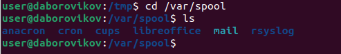

---
## Front matter
lang: ru-RU
title: презентация по лабораторной работе 4
subtitle: Markdown
author:
  - Боровиков Д.А.
institute:
  - Российский университет дружбы народов, Москва, Россия

## i18n babel
babel-lang: russian
babel-otherlangs: english

## Formatting pdf
toc: false
toc-title: Содержание
slide_level: 2
aspectratio: 169
section-titles: true
theme: metropolis
header-includes:
 - \metroset{progressbar=frametitle,sectionpage=progressbar,numbering=fraction}
 - '\makeatletter'
 - '\beamer@ignorenonframefalse'
 - '\makeatother'
---

# Информация

## Докладчик

:::::::::::::: {.columns align=center}
::: {.column width="70%"}

  * Боровиков Даниил Александрович
  * Студент ФМиЕН РУДН
  * Группа НПИбд-01-22

:::
::: {.column width="30%"}

:::
::::::::::::::

# Вводная часть

## Цели и задачи

- Приобретение практических навыков взаимодействия пользователя с системой посредством командной строки.

## Содержание исследования

- Определим командой pwd полное имя домашего каталога.

- Отработка команд cd и ls

- Упражнение в создание и удалении каталогов

- Команда man

- Команда history

# Определение имени домашнего каталога 

{#fig:001 width=70%}

# Команда  ls  с различными опциями

{#fig:002 width=70%}

# Команда  ls  с различными опциями

{#fig:003 width=70%}

# Проверка наличия подкаталога cron

{#fig:004 width=70%}

# Определения владельца файлов в домашнем каталоге

{#fig:005 width=70%}

# Создание требуемых каталогов
{#fig:006 width=70%}

# Удаление созданных каталогов

{#fig:007 width=70%}

# Удаление каталога ~/newdir

{#fig:008 width=70%}

# Удаление каталога ~/newdir/morefun

{#fig:009 width=70%}

# Опция -R команды ls для просмотра содержимого подкаталогов

{#fig:010 width=70%}

# Набор опций -l -t команды ls, позволяющий отсортировать по времени последнего изменения выводимый список содержимого каталога с развёрнутым описанием файлов.

{#fig:010 width=70%}

# Пояснение опций команд

{#fig:010 width=70%}

# Выполнение и модификация команд из буфера команд

{#fig:010 width=70%}

## Вывод

- Углубленно изучили основные команды работы в командной строке

