---
## Front matter
title: "Лабораторная работа No 4. "
subtitle: "Основы интерфейса взаимодействия пользователя с системой Unix на уровне командной строки"
author: "Дмитрий Сергеевич Кулябов"

## Generic otions
lang: ru-RU
toc-title: "Содержание"

## Bibliography
bibliography: bib/cite.bib
csl: pandoc/csl/gost-r-7-0-5-2008-numeric.csl

## Pdf output format
toc: true # Table of contents
toc-depth: 2
lof: true # List of figures
lot: true # List of tables
fontsize: 12pt
linestretch: 1.5
papersize: a4
documentclass: scrreprt
## I18n polyglossia
polyglossia-lang:
  name: russian
  options:
	- spelling=modern
	- babelshorthands=true
polyglossia-otherlangs:
  name: english
## I18n babel
babel-lang: russian
babel-otherlangs: english
## Fonts
mainfont: PT Serif
romanfont: PT Serif
sansfont: PT Sans
monofont: PT Mono
mainfontoptions: Ligatures=TeX
romanfontoptions: Ligatures=TeX
sansfontoptions: Ligatures=TeX,Scale=MatchLowercase
monofontoptions: Scale=MatchLowercase,Scale=0.9
## Biblatex
biblatex: true
biblio-style: "gost-numeric"
biblatexoptions:
  - parentracker=true
  - backend=biber
  - hyperref=auto
  - language=auto
  - autolang=other*
  - citestyle=gost-numeric
## Pandoc-crossref LaTeX customization
figureTitle: "Рис."
tableTitle: "Таблица"
listingTitle: "Листинг"
lofTitle: "Список иллюстраций"
lotTitle: "Список таблиц"
lolTitle: "Листинги"
## Misc options
indent: true
header-includes:
  - \usepackage{indentfirst}
  - \usepackage{float} # keep figures where there are in the text
  - \floatplacement{figure}{H} # keep figures where there are in the text
---

# Цель работы

Приобретение практических навыков взаимодействия пользователя с системой посредством командной строки.

# Выполнение лабораторной работы

Определим полное имя домашнего католога. (рис. @fig:001).

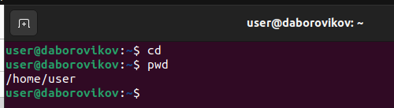{#fig:001 width=70%}

 Перейдием в каталог /tmp. Выведите на экран содержимое каталога /tmp. Для этого используем команду ls с различными опциями. Поясним разницу в выводимой на экран информации.(рис. @fig:002).

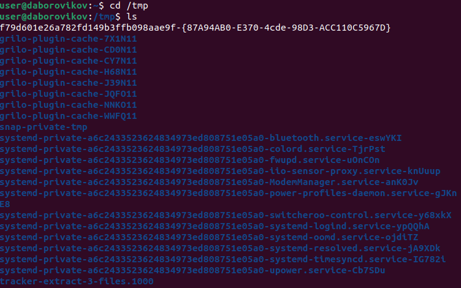{#fig:002 width=70%}

(рис. @fig:003).

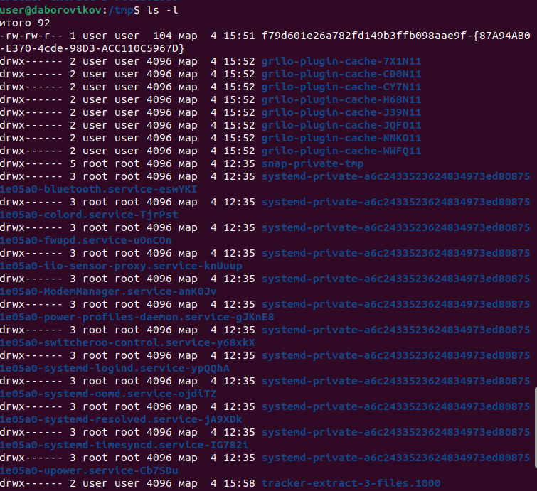{#fig:003 width=70%}

Опции команды ls:
-a - отображает скрытые файлы
-l - выводит подробный список владелец, группа, дата создания, размер и другие параметры
-t - по времени последней модификации;

Перейдем в каталог /var/spool. В нем находится подкаталог cron(рис. @fig:004).

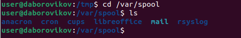{#fig:004 width=70%}

Перейдем в домашний каталог и определим владельца файлов и подкаталогов(рис. @fig:005).

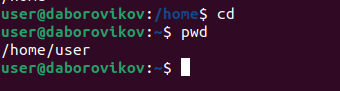{#fig:005 width=70%}

В домашнем каталоге создадим новый каталог с именем newdir. В каталоге ~/newdir создадим новый каталог с именем morefun. В домашнем каталоге создадим одной командой три новых каталога с именами letters, memos, misk.(рис. @fig:006).

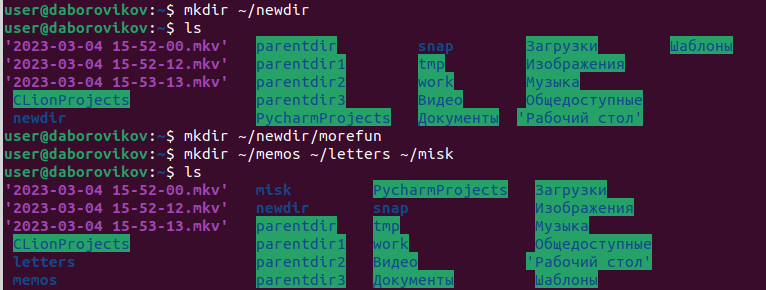{#fig:006 width=70%}

Удалим созданные каталоги одной командой(рис. @fig:007).

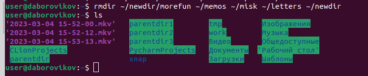{#fig:007 width=70%}

Попробуем удалить ранее созданный каталог ~/newdir командой rm. Каталог не был удален из-за наличия в нем подкаталога(рис. @fig:008).

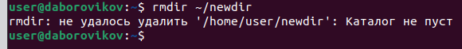{#fig:008 width=70%}

Удалим каталог ~/newdir/morefun
(рис. @fig:009).

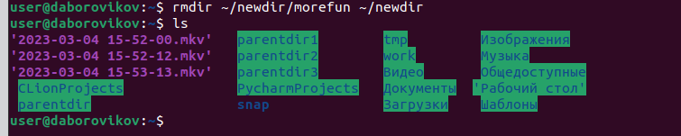{#fig:009 width=70%}

С помощью команды man определим, опцию -R команды ls  для просмотра содержимого не только указанного каталога, но и подкаталогов, входящих в него.(рис. @fig:010).

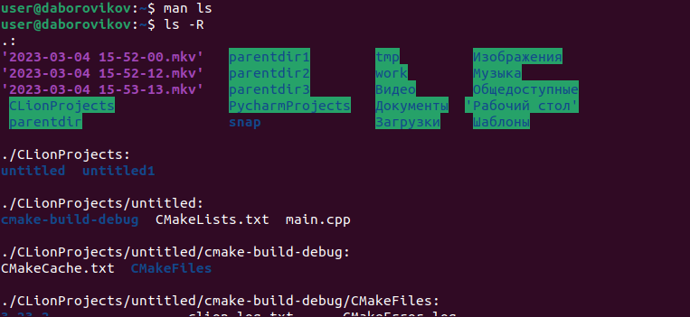{#fig:010 width=70%}

С помощью команды man определим набор опций -l -t команды ls, позволяющий отсортировать по времени последнего изменения выводимый список содержимого каталога с развёрнутым описанием файлов.(рис. @fig:011).

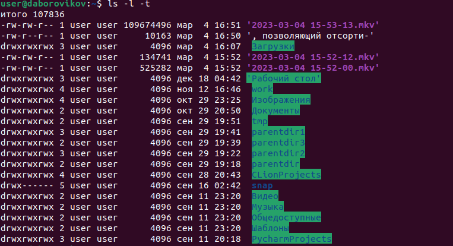{#fig:011 width=70%}

Использем команду man для просмотра описания следующих команд: cd, pwd, mkdir, rmdir, rm. Поясним основные опции этих команд.(рис. @fig:012).

Описание опций команд:

cd - отсутствуют

pwd

-P - отбрасывать все символические ссылки;

--help - отобразить справку по утилите;

--version - отобразить версию утилиты.

mkdir

-p - cоздать все директории, которые указаны внутри пути. Если какая-либо директория существует, то предупреждение об этом не выводится.

-v - выводить сообщение о каждой создаваемой директории.

rmdir 

--ignore-fail-on-non-empty -   игнорировать каждый сбой, который происходит исключительно из-за того, что каталог не пуст.

rm

-f - игнорировать несуществующие файлы и аргументы. Никогда не выдавать запросы на подтверждение удаления.

-i - выводить запрос на подтверждение удаления каждого файла.

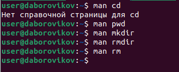{#fig:012 width=70%}

Используя информацию, полученную при помощи команды history, выполним модификацию и исполнение нескольких команд из буфера команд(рис. @fig:013).

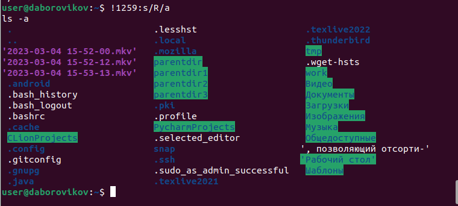{#fig:013 width=70%}
# Выводы

В ходе лабораторной работы мы приобрели практические навыки взаимодействия пользователя с системой посредством команной строки.

#Контрольные вопросы

1. Что такое командная строка?

Место работы с системой посредством команд.

2. При помощи какой команды можно определить абсолютный путь текущего каталога? pwd. 

3. При помощи какой команды и каких опций можно определить только тип файлов и их имена в текущем каталоге? ls

4. Каким образом отобразить информацию о скрытых файлах? Командой ls -a. В лабораторной было

5. При помощи каких команд можно удалить файл и каталог? Можно ли это сделать одной и той же командой? Командой rm - можно удалить файл. А командой rm -r , рекурсивной удалить и файлы и каталоги. В лабораторной
примеры были

6. Каким образом можно вывести информацию о последних выполненных пользователем командах? Команда history

7. Как воспользоваться историей команд для их модифицированного выполнения? Стрелкой вверх и вниз можно листать последние команды. Примеры в лаб. работе были

8. Приведите примеры запуска нескольких команд в одной строке. apt update && apt upgrade

9. Дайте определение и приведите примера символов экранирования. Если в заданном контексте встречаются специальные символы (типа «.», «/», «*» и т.д.), надо перед ними поставить символ экранирования (обратный слэш). Даёт понять консоли, что обособленное и текст является одной частью.

10. Охарактеризуйте вывод информации на экран после выполнения команды ls с опцией l. Полное подробное описание содержимого в указанном каталоге

11. Что такое относительный путь к файлу? Приведите примеры использования относительного и абсолютного пути при выполнении какой-либо команды. если писать сразу название папки файла, то его никак не выделяют. Но полный путь начинается с /. Например ls work , находясь в домашенм каталоге аналогичен ls /home/user/work

12. Как получить информацию об интересующей вас команде? Команда man. Например man ls

13. Какая клавиша или комбинация клавиш служит для автоматического дополнения вводимых команд? Кнопка TAB

