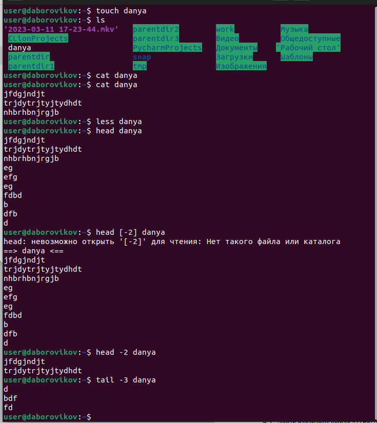
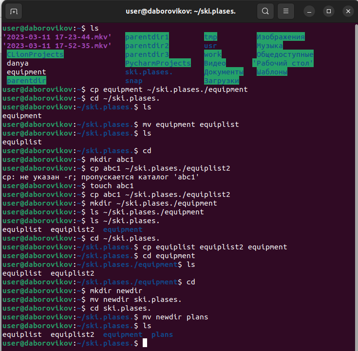
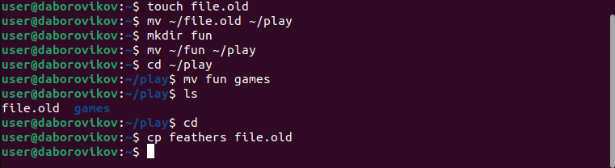
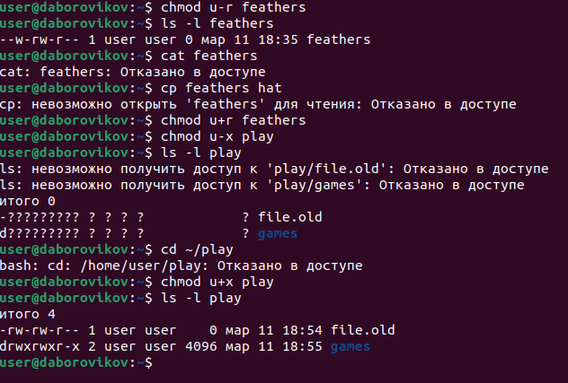

---
## Front matter
lang: ru-RU
title: презентация по лабораторной работе 5
subtitle: Markdown
author:
  - Боровиков Д.А.
institute:
  - Российский университет дружбы народов, Москва, Россия

## i18n babel
babel-lang: russian
babel-otherlangs: english

## Formatting pdf
toc: false
toc-title: Содержание
slide_level: 2
aspectratio: 169
section-titles: true
theme: metropolis
header-includes:
 - \metroset{progressbar=frametitle,sectionpage=progressbar,numbering=fraction}
 - '\makeatletter'
 - '\beamer@ignorenonframefalse'
 - '\makeatother'
---

# Информация

## Докладчик

:::::::::::::: {.columns align=center}
::: {.column width="70%"}

  * Боровиков Даниил Александрович
  * Студент ФМиЕН РУДН
  * Группа НПИбд-01-22

:::
::: {.column width="30%"}

:::
::::::::::::::

# Вводная часть

## Цели и задачи

- Ознакомление с файловой системой Linux, её структурой, именами и содержа-
нием каталогов. Приобретение практических навыков по применению команд
для работы с файлами и каталогами, по управлению процессами (и работами),
по проверке исполь- зования диска и обслуживанию файловой системы.

## Команды для работы с файлами и каталогами

{#fig:002 width=70%}

## Копирование файлов и каталогов

{#fig:003 width=70%}

## Опции команды chmod, необходимые для того, чтобы присвоить файлам права доступа

{#fig:004 width=70%}

## Перемещение файлов и каталогов

{#fig:005 width=70%}

## Права доступа
{#fig:006 width=70%}

## man по командам mount, fsck, mkfs, kill

{#fig:007 width=70%}

## Вывод

-В ходе лабораторной работы мы ознакомились с файловой системой Linux, её
структурой, именами и содержанием каталогов. Приобрели практические навыки
по применению команд для работы с файлами и каталогами, по управлению
процессами (и работами), по проверке использования диска и обслуживанию
файловой системы.

