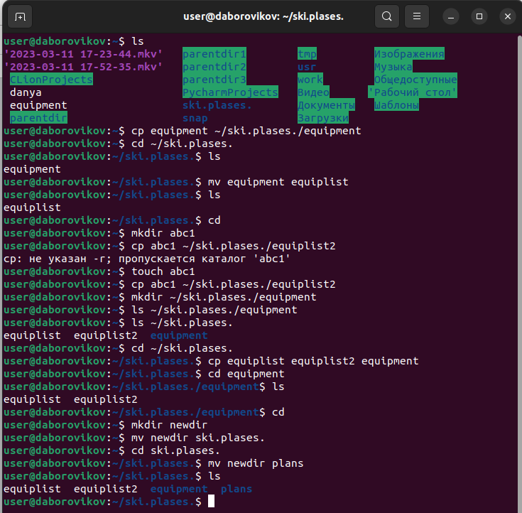

---
## Front matter
title: "Лабораторная работа No 5. "
subtitle: "Основы интерфейса взаимодействия пользователя с системой Unix на уровне командной строки"
author: "Боровиков Даниил Александрович"

## Generic otions
lang: ru-RU
toc-title: "Содержание"

## Bibliography
bibliography: bib/cite.bib
csl: pandoc/csl/gost-r-7-0-5-2008-numeric.csl

## Pdf output format
toc: true # Table of contents
toc-depth: 2
lof: true # List of figures
lot: true # List of tables
fontsize: 12pt
linestretch: 1.5
papersize: a4
documentclass: scrreprt
## I18n polyglossia
polyglossia-lang:
  name: russian
  options:
	- spelling=modern
	- babelshorthands=true
polyglossia-otherlangs:
  name: english
## I18n babel
babel-lang: russian
babel-otherlangs: english
## Fonts
mainfont: PT Serif
romanfont: PT Serif
sansfont: PT Sans
monofont: PT Mono
mainfontoptions: Ligatures=TeX
romanfontoptions: Ligatures=TeX
sansfontoptions: Ligatures=TeX,Scale=MatchLowercase
monofontoptions: Scale=MatchLowercase,Scale=0.9
## Biblatex
biblatex: true
biblio-style: "gost-numeric"
biblatexoptions:
  - parentracker=true
  - backend=biber
  - hyperref=auto
  - language=auto
  - autolang=other*
  - citestyle=gost-numeric
## Pandoc-crossref LaTeX customization
figureTitle: "Рис."
tableTitle: "Таблица"
listingTitle: "Листинг"
lofTitle: "Список иллюстраций"
lotTitle: "Список таблиц"
lolTitle: "Листинги"
## Misc options
indent: true
header-includes:
  - \usepackage{indentfirst}
  - \usepackage{float} # keep figures where there are in the text
  - \floatplacement{figure}{H} # keep figures where there are in the text
---

# Цель работы

Ознакомление с файловой системой Linux, её структурой, именами и содержанием
каталогов. Приобретение практических навыков по применению команд для работы
с файлами и каталогами, по управлению процессами (и работами), по проверке исполь-
зования диска и обслуживанию файловой системы.

# Выполнение лабораторной работы

Создадим текстовый файл при помощи команды touch, просмотрим содержимое файла командой cat,  постранично просмотрим файл(less), выведем строки с конца и с начала(head, tail).(рис. @fig:001).

{#fig:001 width=70%}

 Скопируем файл /usr/include/sys/io.h в домашний каталог и назовите его
equipment. Если файла io.h нет, то используйте любой другой файл в каталоге
/usr/include/sys/ вместо него. (команда cp). В домашнем каталоге создадим директорию ~/ski.plases.(mkdir). Переместите файл equipment в каталог ~/ski.plases. Переименуем файл ~/ski.plases/equipment в ~/ski.plases/equiplist.(mv equipment equiplist). Создадим в домашнем каталоге файл abc1 и скопируйте его в каталог ~/ski.plases,(touch, cp) назовите его equiplist2.(mv abc1 equiplist2) Создадим каталог с именем equipment в каталоге ~/ski.plases. (mkdir ~/ski.plases/equipment). Переместим файлы ~/ski.plases/equiplist и equiplist2 в каталог ~/ski.plases/equipment. (mv equiplist equiplist2 equipment). Создайте и переместите каталог ~/newdir в каталог ~/ski.plases и назовите его plans.(рис. @fig:002).(mv)

{#fig:002 width=70%}

Опции команды chmod, необходимые для того, чтобы присвоить файлам выделенные права доступа,(рис. @fig:003).

{#fig:003 width=70%}

Просмотрим содержимое файла /etc/password.(рис. @fig:004).

{#fig:004 width=70%}

Скопируем файл ~/feathers в файл ~/file.old. Переместим файл ~/file.old в каталог ~/play. Скопируем каталог ~/play в каталог ~/fun(рис. @fig:005).

{#fig:005 width=70%}

Лишим владельца файла ~/feathers права на чтение. Посмотрим что произойдёт, если мы попытаемся просмотреть файл ~/feathers командой
cat. Посмотрим что произойдёт, если мы попытаемся скопировать файл ~/feathers. Дадим владельцу файла ~/feathers право на чтение. Лишим владельца каталога ~/play права на выполнение. Перейдем в каталог ~/play. Дадим владельцу каталога ~/play право на выполнение.(рис. @fig:006).

{#fig:006 width=70%}

Прочитаем man по командам mount, fsck, mkfs, kill.(рис. @fig:007).

{#fig:007 width=70%}

# Выводы

В ходе лабораторной работы мы ознакомились с файловой системой Linux, её структурой, именами и содержанием каталогов. Приобрели практические навыки по применению команд для работы с файлами и каталогами, по управлению процессами (и работами), по проверке использования диска и обслуживанию файловой системы.

# Контрольные вопросы

1. ext4 — журналируемая файловая система, используемая преимущественно в операционных системах с ядром Linux, созданная на базе ext3 в 2006 году. Основные изменения в ext4 по сравнению с ext3: увеличен максимальный объём одного раздела диска до 1 эксбибайта при размере блока 4 кибибайт;

2. Приведите общую структуру файловой системы и дайте характеристику каждой директории первого уровня этой структуры.

/ — root каталог. Содержит в себе всю иерархию системы;

/bin — здесь находятся двоичные исполняемые файлы. Основные общие команды, хранящиеся отдельно от других программ в системе (прим.: pwd, ls, cat, ps);

/boot — тут расположены файлы, используемые для загрузки системы (образ initrd, ядро vmlinuz);

/dev — в данной директории располагаются файлы устройств (драйверов). С помощью этих файлов можно взаимодействовать с устройствами. К примеру, если это жесткий диск, можно подключить его к файловой системе. В файл принтера же можно написать напрямую и отправить задание на печать;

/etc — в этой директории находятся файлы конфигураций программ. Эти файлы позволяют настраивать системы, сервисы, скрипты системных демонов;

/home — каталог, аналогичный каталогу Users в Windows. Содержит домашние каталоги учетных записей пользователей (кроме root). При создании нового пользователя здесь создается одноименный каталог с аналогичным именем и хранит личные файлы этого пользователя;

/lib — содержит системные библиотеки, с которыми работают программы и модули ядра;

/lost+found — содержит файлы, восстановленные после сбоя работы системы. Система проведет проверку после сбоя и найденные файлы можно будет посмотреть в данном каталоге;

/media — точка монтирования внешних носителей. Например, когда вы вставляете диск в дисковод, он будет автоматически смонтирован в директорию /media/cdrom;

/mnt — точка временного монтирования. Файловые системы подключаемых устройств обычно монтируются в этот каталог для временного использования;

/opt — тут расположены дополнительные (необязательные) приложения. Такие программы обычно не подчиняются принятой иерархии и хранят свои файлы в одном подкаталоге (бинарные, библиотеки, конфигурации);

/proc — содержит файлы, хранящие информацию о запущенных процессах и о состоянии ядра ОС;

/root — директория, которая содержит файлы и личные настройки суперпользователя;

/run — содержит файлы состояния приложений. Например, PID-файлы или UNIX-сокеты;

/sbin — аналогично /bin содержит бинарные файлы. Утилиты нужны для настройки и администрирования системы суперпользователем;

/srv — содержит файлы сервисов, предоставляемых сервером (прим. FTP или Apache HTTP);

/sys — содержит данные непосредственно о системе. Тут можно узнать информацию о ядре, драйверах и устройствах;

/tmp — содержит временные файлы. Данные файлы доступны всем пользователям на чтение и запись. Стоит отметить, что данный каталог очищается при перезагрузке;

/usr — содержит пользовательские приложения и утилиты второго уровня, используемые пользователями, а не системой. Содержимое доступно только для чтения (кроме root). Каталог имеет вторичную иерархию и похож на корневой;

/var — содержит переменные файлы. Имеет подкаталоги, отвечающие за отдельные переменные. Например, логи будут храниться в /var/log, кэш в /var/cache, очереди заданий в /var/spool/ и так далее.

3.  Монтирование тома. -> mount

4. Отсутствие синхронизации между образом файловой системы в памяти и ее данными на диске в случае аварийного останова может привести к появлению ошибок -> fsck - команда проверяющая файловую систему на наличие ошибок и исправляет их.

5. mkfs - позволяет создать файловую систему Linux.

6. Cat - выводит содержимое файла на стандартное устройство вывода

7. Cp – копирует или перемещает директорию, файлы.

8. Mv - переименовать или переместить файл или директорию

9. Права доступа к файлу или каталогу можно изменить, воспользовавшись командой chmod. Сделать это может владелец файла (или каталога) или пользователь с правами администратора.

