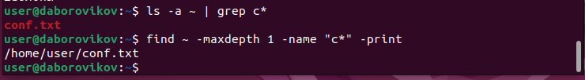
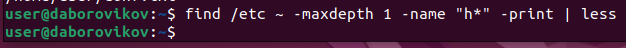
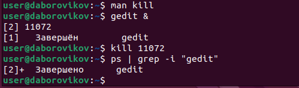

---
## Front matter
lang: ru-RU
title: презентация по лабораторной работе 6
subtitle: Поиск файлов. Перенаправление ввода-вывода. Просмотр запущенных процессов

author:
  - Боровиков Д.А.
institute:
  - Российский университет дружбы народов, Москва, Россия

## i18n babel
babel-lang: russian
babel-otherlangs: english

## Formatting pdf
toc: false
toc-title: Содержание
slide_level: 2
aspectratio: 169
section-titles: true
theme: metropolis
header-includes:
 - \metroset{progressbar=frametitle,sectionpage=progressbar,numbering=fraction}
 - '\makeatletter'
 - '\beamer@ignorenonframefalse'
 - '\makeatother'
---

# Информация

## Докладчик

:::::::::::::: {.columns align=center}
::: {.column width="70%"}

  * Боровиков Даниил Александрович
  * Студент ФМиЕН РУДН
  * Группа НПИбд-01-22

:::
::: {.column width="30%"}

:::
::::::::::::::

# Вводная часть

## Цели и задачи

- Ознакомление с инструментами поиска файлов и фильтрации текстовых данных. Приобретение практических навыков: по управлению процессами (и заданиями), по проверке использования диска и обслуживанию файловых систем

## Перенос названия файлов из каталога в файл.

{#fig:002 width=70%}

## Вывод файлов с расширением .conf

{#fig:003 width=70%}

## Поиск файлов начинавшиеся с символа c
{#fig:004 width=70%}

## Файлы из каталога /etc, начинающиеся с символа h

{#fig:005 width=70%}

## Фоновый процесс, который записывает в файл ~/logfile файлы, имена которых начинаются с log
{#fig:006 width=70%}

## Удаление ~/logfile

{#fig:007 width=70%}

## gedit в фоновом режиме

{#fig:008 width=70%}

## Определение идентификатора процесса gedit

{#fig:009 width=70%}

## Завершение процесса gedit

{#fig:010 width=70%}

## Команды df и du

{#fig:011 width=70%}

## Вывод имен всех директорий домашнего каталога

{#fig:012 width=70%}

## Вывод

В ходе лабораторной работы мы ознакомились с инструментами поиска файлов и фильтрации текстовых данных. Приобрели практические навыки: по управлению процессами (и заданиями), по проверке использования диска и обслуживанию файловых систем.

