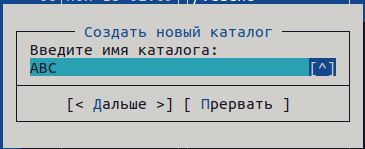
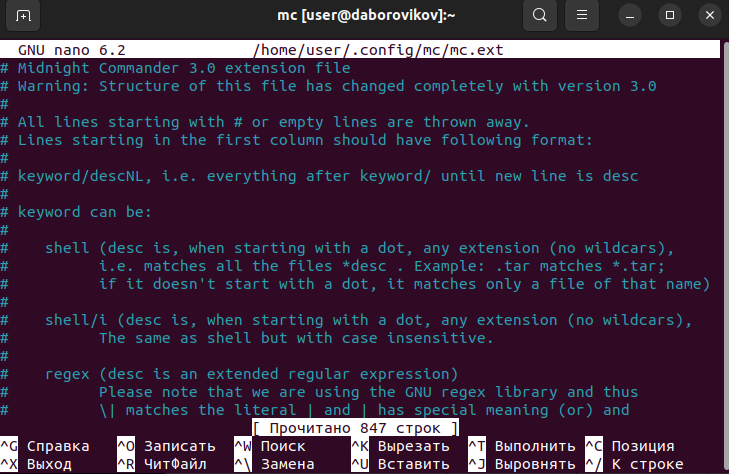
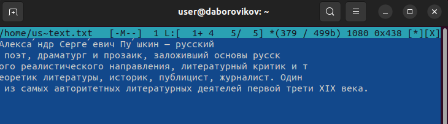

---
## Front matter
lang: ru-RU
title: презентация по лабораторной работе 7
subtitle: Командная оболочка Midnight

author:
  - Боровиков Д.А.
institute:
  - Российский университет дружбы народов, Москва, Россия

## i18n babel
babel-lang: russian
babel-otherlangs: english

## Formatting pdf
toc: false
toc-title: Содержание
slide_level: 2
aspectratio: 169
section-titles: true
theme: metropolis
header-includes:
 - \metroset{progressbar=frametitle,sectionpage=progressbar,numbering=fraction}
 - '\makeatletter'
 - '\beamer@ignorenonframefalse'
 - '\makeatother'
---

# Информация

## Докладчик

:::::::::::::: {.columns align=center}
::: {.column width="70%"}

  * Боровиков Даниил Александрович
  * Студент ФМиЕН РУДН
  * Группа НПИбд-01-22

:::
::: {.column width="30%"}

:::
::::::::::::::

# Вводная часть

## Цели и задачи

- Ознакомление с инструментами поиска файлов и фильтрации текстовых данных. Приобретение практических навыков: по управлению процессами (и заданиями), по проверке использования диска и обслуживанию файловых систем

## Изучение команды mc через man

{#fig:002 width=70%}

## Запустим из командной строки mc, изучим его структуру и меню.

{#fig:003 width=70%}

## Выполним несколько операций в mc, используя управляющие клавиши (операции с панелями) 

{#fig:004 width=70%}

## Выполним несколько операций в mc, используя управляющие клавиши (операции с панелями) 

{#fig:005 width=70%}

## Выполним выделение и отменим его 

{#fig:006 width=70%}

## Скопируем файлы 

{#fig:007 width=70%}

## Переместим файлы

{#fig:008 width=70%}

## Получим информацию о размере и правах доступа на файлы и/или каталоги 
{#fig:009 width=70%}

## Получим информацию о размере файла

{#fig:010 width=70%}

## Просмотрим содержимое текстового файла (mcedit)

{#fig:011 width=70%}

## Отредактируем содержимое текстового файла (без сохранения результатов редактирования)

{#fig:012 width=70%}

## Создадим каталог

{#fig:013 width=70%}

## Скопируем файлы в созданный каталог

{#fig:014 width=70%}

## Осуществим поиск в файловой системе файла с заданными условиями (файла с расширением .c)

{#fig:015 width=70%}

## Осуществим поиск в файловой системе файла с заданными условиями 

{#fig:016 width=70%}

## Осуществим поиск в файловой системе файла с заданными условиями (файла содержащего строку main)

{#fig:017 width=70%}

## Выборем и повторим одну из предыдущих команд

{#fig:018 width=70%}

## Перейдем в домашний каталог

{#fig:019 width=70%}

## Проведем анализ файла меню и файла расширений.

{#fig:020 width=70%}

## Проведем анализ файла меню и файла расширений.

{#fig:021 width=70%}

## Вызовем подменю Настройки 

{#fig:022 width=70%}

## Создадим текстовой файл text.txt.

{#fig:023 width=70%}

## Откроем этот файл с помощью встроенного в mc редактора.

{#fig:024 width=70%}

## Вставим в открытый файл небольшой фрагмент текста из Интернета.

{#fig:025 width=70%}

## Удалим строку текста.

{#fig:026 width=70%}

## Выделим фрагмент текста и скопируем его на новую строку.

{#fig:27 width=70%}

## Сохраним файл

{#fig:028 width=70%}

## Выделите фрагмент текста и перенесите его на новую строку.

{#fig:029 width=70%}

## Откроем файл с исходным текстом на некотором языке программированияю Используя меню редактора, включим подсветку синтаксиса, если она не включена, или выключите, если она включена.

{#fig:030 width=70%}

## Вывод

В ходе лабораторной работы мы освоили основные возможности командной оболочки Midnight Commander. Приобрели навыки практической работы по просмотру каталогов и файлов, манипуляций с ними.

