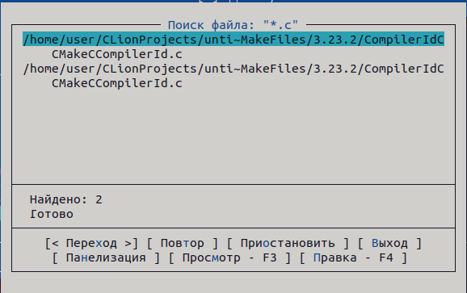
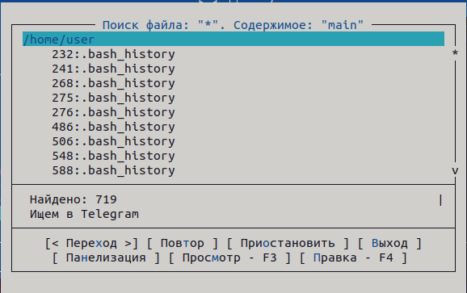
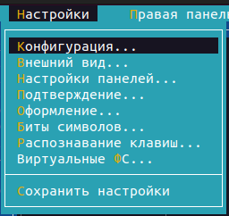
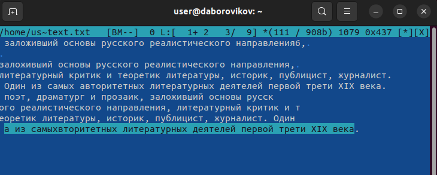

---
## Front matter
title: "Лабораторная работа No 7. "
subtitle: "Командная оболочка Midnight
Commander"
author: "Боровиков Даниил Александрович"

## Generic otions
lang: ru-RU
toc-title: "Содержание"

## Bibliography
bibliography: bib/cite.bib
csl: pandoc/csl/gost-r-7-0-5-2008-numeric.csl

## Pdf output format
toc: true # Table of contents
toc-depth: 2
lof: true # List of figures
lot: true # List of tables
fontsize: 12pt
linestretch: 1.5
papersize: a4
documentclass: scrreprt
## I18n polyglossia
polyglossia-lang:
  name: russian
  options:
	- spelling=modern
	- babelshorthands=true
polyglossia-otherlangs:
  name: english
## I18n babel
babel-lang: russian
babel-otherlangs: english
## Fonts
mainfont: PT Serif
romanfont: PT Serif
sansfont: PT Sans
monofont: PT Mono
mainfontoptions: Ligatures=TeX
romanfontoptions: Ligatures=TeX
sansfontoptions: Ligatures=TeX,Scale=MatchLowercase
monofontoptions: Scale=MatchLowercase,Scale=0.9
## Biblatex
biblatex: true
biblio-style: "gost-numeric"
biblatexoptions:
  - parentracker=true
  - backend=biber
  - hyperref=auto
  - language=auto
  - autolang=other*
  - citestyle=gost-numeric
## Pandoc-crossref LaTeX customization
figureTitle: "Рис."
tableTitle: "Таблица"
listingTitle: "Листинг"
lofTitle: "Список иллюстраций"
lotTitle: "Список таблиц"
lolTitle: "Листинги"
## Misc options
indent: true
header-includes:
  - \usepackage{indentfirst}
  - \usepackage{float} # keep figures where there are in the text
  - \floatplacement{figure}{H} # keep figures where there are in the text
---

# Цель работы

Освоение основных возможностей командной оболочки Midnight Commander. Приоб-
ретение навыков практической работы по просмотру каталогов и файлов; манипуляций
с ними

# Выполнение лабораторной работы

  Изучение информации о mc, вызвав в командной строке man mc.(рис. @fig:002).

{#fig:002 width=70%}

Запустим из командной строки mc, изучим его структуру и меню.(рис. @fig:003).

{#fig:003 width=70%}

Выполним несколько операций в mc, используя управляющие клавиши (операции
с панелями) (рис. @fig:004).

{#fig:004 width=70%}

Выполним несколько операций в mc, используя управляющие клавиши (операции
с панелями) (рис. @fig:005).

{#fig:005 width=70%}

Выполним выделение и отменим его (рис. @fig:006).

{#fig:006 width=70%}

Скопируем файлы (рис. @fig:007).

{#fig:007 width=70%}

Переместим файлы(рис. @fig:008).

{#fig:008 width=70%}

Получим информацию о размере и правах доступа на файлы и/или каталоги (рис. @fig:009).

{#fig:009 width=70%}

Получим информацию о размере файла(рис. @fig:010).

{#fig:010 width=70%}

Просмотрим содержимое текстового файла (mcedit)(рис. @fig:011).

{#fig:011 width=70%}

Отредактируем содержимое текстового файла (без сохранения результатов
редактирования)(рис. @fig:012).

{#fig:012 width=70%}

Создадим каталог(рис. @fig:013).

{#fig:013 width=70%}

Скопируем файлы в созданный каталог(рис. @fig:014).

{#fig:014 width=70%}

Осуществим поиск в файловой системе файла с заданными условиями (файла
с расширением .c)(рис. @fig:015).

{#fig:015 width=70%}

Осуществим поиск в файловой системе файла с заданными условиями (файла
с расширением .cpp)(рис. @fig:016).

{#fig:016 width=70%}

Осуществим поиск в файловой системе файла с заданными условиями (файла
содержащего строку main)(рис. @fig:017).

{#fig:017 width=70%}

Выборем и повторим одну из предыдущих команд(рис. @fig:018).

{#fig:018 width=70%}

Перейдем в домашний каталог;(рис. @fig:019).

{#fig:019 width=70%}

Проведем анализ файла меню и файла расширений.(рис. @fig:020).

{#fig:020 width=70%}

Проведем анализ файла меню и файла расширений.(рис. @fig:021).

{#fig:021 width=70%}

Вызовем подменю Настройки (рис. @fig:022).

{#fig:022 width=70%}

Создадим текстовой файл text.txt.(рис. @fig:023).

{#fig:023 width=70%}

Откроем этот файл с помощью встроенного в mc редактора.(рис. @fig:024).

{#fig:024 width=70%}

Вставим в открытый файл небольшой фрагмент текста из Интернета.(рис. @fig:025).

{#fig:025 width=70%}

Удалим строку текста.(рис. @fig:026).

{#fig:026 width=70%}

Выделим фрагмент текста и скопируем его на новую строку.(рис. @fig:027).

{#fig:27 width=70%}

Сохраним файл(рис. @fig:028).

{#fig:028 width=70%}

Выделите фрагмент текста и перенесите его на новую строку.(рис. @fig:029).

{#fig:029 width=70%}

Откроем файл с исходным текстом на некотором языке программированияю Используя меню редактора, включим подсветку синтаксиса, если она не включена,
или выключите, если она включена.(рис. @fig:030).

{#fig:030 width=70%}

# Выводы

В ходе лабораторной работы мы освоили основные возможности командной оболочки Midnight Commander. Приобрели навыки практической работы по просмотру каталогов и файлов, манипуляций с ними.

# Контрольные вопросы

1. Какие режимы работы есть в mc. Охарактеризуйте их.

Панели могут дополнительно быть переведены в один из двух режимов: «Инфор-
мация» или «Дерево». В режиме «Информация» на панель выводятся сведения о
файле и текущей файловой системе, расположенных на активной панели. В режиме
«Дерево» на одной из панелей выводится структура дерева каталогов.

2. Какие операции с файлами можно выполнить как с помощью команд shell, так
и с помощью меню (комбинаций клавиш) mc? Приведите несколько примеров.

• копирование «F5» («cp имя_файла имя_каталога (в который копируем)»)

• перемещение/переименование «F6» («mv имя_файла имя_каталога (в который
перемещаем)»)

• создание каталога «F7» («mkdir имя_каталога»)

• удаление «F8» («rm имя_файла»)

• изменение прав доступа «ctrl+x» («chmod u+x имя_файла»)

3. Опишите структура меню левой (или правой) панели mc, дайте характеристику
командам.

Перейти в строку меню панелей mc можно с помощью функциональной клавиши
«F9». В строке меню имеются пять меню: «Леваяпанель», «Файл», «Команда»,
«Настройки» и «Праваяпанель».
Под пункт меню «Быстрый просмотр» позволяет выполнить быстрый просмотр
содержимого панели.

Подпункт меню «Информация» позволяет посмотреть информацию о файле или
каталоге. В меню каждой (левой или правой) панели можно выбрать «Формат
списка»:

• стандартный: выводит список файлов и каталогов с указанием размера и
времени правки;

• ускоренный: позволяет задать число столбцов, на которые разбивается панель
при выводе списка имён файлов или каталогов без дополнительной информа-
ции;

• расширенный: помимо названия файла или каталога выводит сведения о правах
доступа, владельце, группе, размере, времени правки;

• определённый пользователем: позволяет вывести те сведения о файле или
каталоге, которые задаст сам пользователь.

Подпункт меню «Порядок сортировки» позволяет задать критерии сортировки
при выводе списка файлов и каталогов: без сортировки, по имени, расширенный,
время правки, время доступа, время изменения атрибута, размер, узел.

4. Опишите структура меню Файл mc, дайте характеристику командам.
Команды меню «Файл»:

• Просмотр(«F3»): позволяет посмотреть содержимое текущего (или выделенно-
го) файла без возможности редактирования.

• Просмотр вывода команды («М»+«!»): функция запроса команды с парамет-
рами (аргумент к текущему выбранному файлу).

• Правка(«F4»): открывает текущий (или выделенный) файл для его редакти-
рования.

• Копирование(«F5»): осуществляет копирование одного или нескольких файлов
или каталогов в указанное пользователем во всплывающем окне место.

• Права доступа («Ctrl-x»«c»): позволяет указать (изменить) права доступа к
одному или нескольким файлам или каталогам.

• Жёсткая ссылка («Ctrl-x»«l»): позволяет создать жёсткую ссылку к текуще-
му(или выделенному) файлу.

• Символическая ссылка («Ctrl-x»«s»): позволяет создать символическую ссылку
к текущему (или выделенному) файлу.

• Владелец/группа («Ctrl-x»«o»): позволяет задать (изменить) владельца и имя
группы для одного или нескольких файлов или каталогов.

• Права(расширенные): позволяет изменить права доступа и владения для одного
или нескольких файлов или каталогов.

• Переименование («F6»): позволяет переименовать (или переместить) один или
несколько файлов или каталогов.

• Создание каталога («F7»): позволяет создать каталог.

• Удалить («F8»): позволяет удалить один или несколько файлов или каталогов.
• Выход («F10»): завершает работу mc.

5. Опишите структура меню Команда mc, дайте характеристику командам.
Меню Команда

В меню Команда содержатся более общие команды для работы с mc.
Команды меню Команда:

• Дерево каталогов: отображает структуру каталогов системы.

• Поиск файла: выполняет поиск файлов по заданным параметрам.

• Переставить панели: меняет местами левую и правую панели.

• Сравнить каталоги («Ctrl-x»«d»): сравнивает содержимое двух каталогов.

• Размеры каталогов: отображает размер и время изменения каталога (по умол-
чанию в mc размер каталога корректно не отображается).

• История командной строки: выводит на экран список ранее выполненных в
оболочке команд.

• Каталоги быстрого доступа(Ctrl-»): при вызове выполняется быстрая смена
текущего каталога на один из заданного списка.

• Восстановление файлов: позволяет восстановить файлы на файловых системах
ext2 и ext3.

• Редактировать файл меню: позволяет отредактировать контекстное меню
пользователя, вызываемое по клавише «F2».

• Редактировать файл расцветки имён: позволяет подобрать оптимальную для
пользователя расцветку имён файлов в зависимости от их типа.

6. Опишите структура меню Настройки mc, дайте характеристику командам.

Меню Настройки содержит ряд дополнительных опций по внешнему виду и
функциональности mc.

Меню Настройки содержит:

• Конфигурация: позволяет скорректировать настройки работы с панелями.

• Внешний вид и Настройки панелей: определяет элементы (строка меню, ко-
мандная строка, подсказки и прочее), отображаемые при вызове mc, а также
геометрию расположения панелей и цветовыделение.

• Биты символов: задаёт формат обработки информации локальным терминалом.

• Подтверждение: позволяет установить или убрать вывод окна с запросом
подтверждения действий при операциях удаления и перезаписи файлов, а
также при выходе из программы.

• Распознание клавиш: диалоговое окно используется для тестирования функ-
циональных клавиш, клавиш управления курсором и прочее.

• Виртуальные ФС: настройки виртуальной файловой системы: тайм-аут, пароль
и прочее.

7. Назовите и дайте характеристику встроенным командам mc.

Функциональные клавиши mc:

• F1: вызов контекстно-зависимой подсказки

• F2: вызов пользовательского меню с возможностью создания и/или дополнения
дополнительных функций

• F3: просмотр содержимого файла, на который указывает подсветка в активной
панели (без возможности редактирования)

• F4: вызов встроенного в mc редактора для изменения содержания файла, на
который указывает подсветка в активной панели

• F5: копирование одного или нескольких файлов, отмеченных впервой (актив-
ной) панели, в каталог, отображаемый на второй панели

• F6: перенос одного или нескольких файлов, отмеченных в первой (активной)
панели, в каталог, отображаемый на второй панели

• F7: создание подкаталога в каталоге, отображаемом в активной панели

• F8: удаление одного или нескольких файлов (каталогов), отмеченных в первой
(активной) панели файлов

• F9: вызов меню mc

• F10: выход из mc

8. Назовите и дайте характеристику командам встроенного редактора mc.

Встроенный в mc редактор вызывается с помощью функциональной клавиши «F4».
В нём удобно использовать различные комбинации клавиш при редактировании
содержимого (как правило текстового) файла. Клавиши для редактирования файла:

• «Ctrl-y»: удалить строку

• «Ctrl-u»: отмена последней операции

• «ins»: вставка/замена

• «F7»: поиск (можно использовать регулярные выражения)

• «↑-F7»: повтор последней операции поиска

• «F4»: замена

• «F3»: первое нажатие: начало выделения, второе: окончание выделения

• «F5»: копировать выделенный фрагмент

• «F6»: переместить выделенный фрагмент

• «F8»: удалить выделенный фрагмент

• «F2»: записать изменения в файл

• «F10»: выйти из редактор

9. Дайте характеристику средствам mc, которые позволяют создавать меню,
определяемые пользователем.

Для редактирования меню пользователя, которое вызывается клавишей «F2»,
необходимо перейти в пункт «Редактировать файл меню» «Команда» и изменить
настройки файла.

10. Дайте характеристику средствам mc, которые позволяют выполнять действия,
определяемые пользователем, над текущим файлом.

Часть команд «Меню пользователя», а также меню «Файл» позволяют выполнять
действия, определяемые пользователем, над текущим файлом. Например, копирова-
ние каталога или файла, переименование, перемещение, архивирование.

