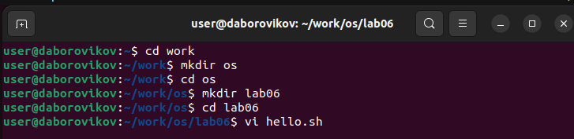
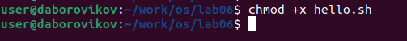
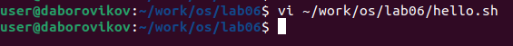
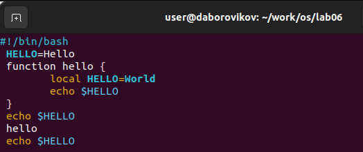
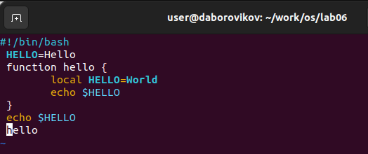
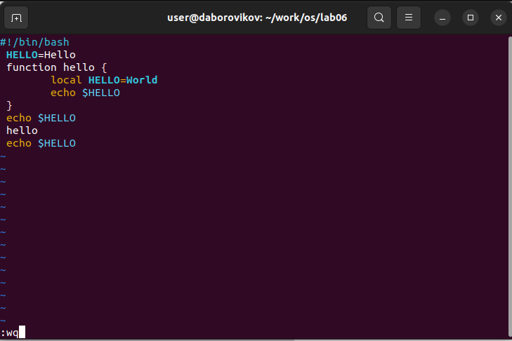

---
## Front matter
lang: ru-RU
title: презентация по лабораторной работе 8
subtitle: Текстовой редактор vi

author:
  - Боровиков Д.А.
institute:
  - Российский университет дружбы народов, Москва, Россия

## i18n babel
babel-lang: russian
babel-otherlangs: english

## Formatting pdf
toc: false
toc-title: Содержание
slide_level: 2
aspectratio: 169
section-titles: true
theme: metropolis
header-includes:
 - \metroset{progressbar=frametitle,sectionpage=progressbar,numbering=fraction}
 - '\makeatletter'
 - '\beamer@ignorenonframefalse'
 - '\makeatother'
---

# Информация

## Докладчик

:::::::::::::: {.columns align=center}
::: {.column width="70%"}

  * Боровиков Даниил Александрович
  * Студент ФМиЕН РУДН
  * Группа НПИбд-01-22

:::
::: {.column width="30%"}

:::
::::::::::::::

# Вводная часть

## Цели и задачи

- Познакомиться с операционной системой Linux. Получить практические навыки работы с редактором vi, установленным по умолчанию практически во всех дистрибутивах

## Создание файла hello.sh

{#fig:002 width=70%}

## Вставка текста в vi

{#fig:003 width=70%}

## Исполнемый файл

{#fig:004 width=70%}

## Вызов vi на редактирование файла

{#fig:005 width=70%}

## Редактирование файла vi

{#fig:006 width=70%}

## Удаление строки

{#fig:007 width=70%}

## Отмена последней команды. Выход из vi с сохранением

{#fig:008 width=70%}

## Вывод

В ходе лабораторной работы мы познакомились с операционной системой Linux. Получили практические навыки работы с редактором vi, установленным по умолчанию практически во всех дистрибутивах.

