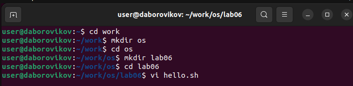
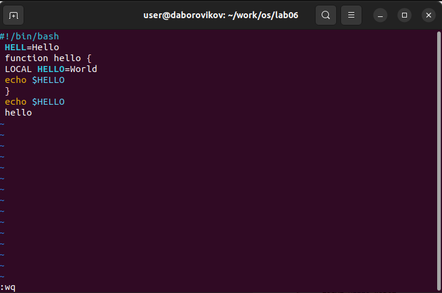
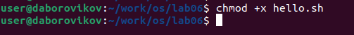
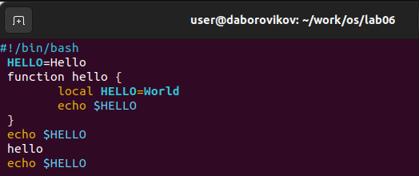

---
## Front matter
title: "Лабораторная работа No 8. "
subtitle: "Текстовой редактор vi"
author: "Боровиков Даниил Александрович"

## Generic otions
lang: ru-RU
toc-title: "Содержание"

## Bibliography
bibliography: bib/cite.bib
csl: pandoc/csl/gost-r-7-0-5-2008-numeric.csl

## Pdf output format
toc: true # Table of contents
toc-depth: 2
lof: true # List of figures
lot: true # List of tables
fontsize: 12pt
linestretch: 1.5
papersize: a4
documentclass: scrreprt
## I18n polyglossia
polyglossia-lang:
  name: russian
  options:
	- spelling=modern
	- babelshorthands=true
polyglossia-otherlangs:
  name: english
## I18n babel
babel-lang: russian
babel-otherlangs: english
## Fonts
mainfont: PT Serif
romanfont: PT Serif
sansfont: PT Sans
monofont: PT Mono
mainfontoptions: Ligatures=TeX
romanfontoptions: Ligatures=TeX
sansfontoptions: Ligatures=TeX,Scale=MatchLowercase
monofontoptions: Scale=MatchLowercase,Scale=0.9
## Biblatex
biblatex: true
biblio-style: "gost-numeric"
biblatexoptions:
  - parentracker=true
  - backend=biber
  - hyperref=auto
  - language=auto
  - autolang=other*
  - citestyle=gost-numeric
## Pandoc-crossref LaTeX customization
figureTitle: "Рис."
tableTitle: "Таблица"
listingTitle: "Листинг"
lofTitle: "Список иллюстраций"
lotTitle: "Список таблиц"
lolTitle: "Листинги"
## Misc options
indent: true
header-includes:
  - \usepackage{indentfirst}
  - \usepackage{float} # keep figures where there are in the text
  - \floatplacement{figure}{H} # keep figures where there are in the text
---

# Цель работы

Познакомиться с операционной системой Linux. Получить практические навыки рабо-
ты с редактором vi, установленным по умолчанию практически во всех дистрибутивах

# Выполнение лабораторной работы

  Создадим каталог с именем ~/work/os/lab06. Перейдем во вновь созданный каталог. Вызовем vi и создадим файл hello.sh(рис. @fig:002).

{#fig:002 width=70%}

Нажмем клавишу i и введем следующий текст. 

1. #!/bin/bash

2. HELL=Hello

3. function hello {

4. LOCAL HELLO=World

5. echo $HELLO

6. }

7. echo $HELLO

8. hello

Нажмем клавишу Esc для перехода в командный режим после завершения ввода
текста.

Нажмем : для перехода в режим последней строки и внизу вашего экрана появится
приглашение в виде двоеточия.

Нажмем w (записать) и q (выйти), а затем нажмите клавишу Enter для сохранения
вашего текста и завершения работы.(рис. @fig:003).

{#fig:003 width=70%}

Сделаем файл исполняемым (рис. @fig:004).

{#fig:004 width=70%}

Вызовем vi на редактирование файла (рис. @fig:005).

{#fig:005 width=70%}

Установим курсор в конец слова HELL второй строки.

Перейдем в режим вставки и замените на HELLO. Нажмем Esc для возврата в командный режим.

 Установим курсор на четвертую строку и сотрем слово LOCAL.
 
 Перейдем в режим вставки и наберите следующий текст: local, нажмем Esc для
возврата в командный режим.

 Установим курсор на последней строке файла. Вставим после неё строку, содержащую следующий текст: echo $HELLO.
 
 Нажмем Esc для перехода в командный режим. (рис. @fig:006).

{#fig:006 width=70%}

Удалим последнюю строку.(рис. @fig:007).

{#fig:007 width=70%}

Введем команду отмены изменений u для отмены последней команды

Введем символ : для перехода в режим последней строки. Запишем произведённые
изменения и выйдите из vi.(рис. @fig:008).

{#fig:008 width=70%}

# Выводы

В ходе лабораторной работы мы познакомились с операционной системой Linux. Получили практические навыки работы с редактором vi, установленным по умолчанию практически во всех дистрибутивах.

# Контрольные вопросы
1. Дайте краткую характеристику режимам работы редактора vi.

Редактор vi имеет три режима работы:

- командный режим: предназначен для ввода команд редактирования и навигации по редактируемому файлу;
- режим вставки: предназначен для ввода содержания редактируемого файла;
- режим последней (или командной) строки: используется для записи изменений в файл и выхода из редактора. 

2. Как выйти из редактора, не сохраняя произведённые изменения?

Чтобы выйти из редактора, не сохраняя произведённые изменения, нужно в режиме командной строки нажать клавиши «:» «q» «!» 

3. Назовите и дайте краткую характеристику командам позиционирования.

Команды позиционирования:

- «0»(ноль): переход в начало строки;
- «$»: переход в конец строки;
- «G»: переход в конец файла;
- n«G»: переход на строку с номером n. 

4. Что для редактора vi является словом?

При использовании прописных W и B под разделителями понимаются только пробел, табуляция и возврат каретки. При использовании строчных w и b под разделителями понимаются также любые знаки пунктуации. 

5. Каким образом из любого места редактируемого файла перейти в начало (конец) файла?

Чтобы из любого места редактируемого файла перейти в начало (конец) файла, нужно в режиме командной строки нажать клавиши «1» «G» («G»). 

6. Назовите и дайте краткую характеристику основным группам команд редактирования.

Команды редактирования:

Вставка текста:

- «а»: вставить текст после курсора;
- «А»: вставить текст в конец строки;
- «i»: вставить текст перед курсором;
- n «i»: вставить текст n раз;
- «I»: вставить текст в начало строки.

Вставка строки:

- «о»: вставить строку под курсором;
- «О»: вставить строку над курсором.

Удаление текста:

- «x»: удалить один символ в буфер;
- «d» «w»: удалить одно слово в буфер;
- «d» «$»: удалить в буфер текст от курсора до конца строки;
- «d» «0»: удалить в буфер текст от начала строки до позиции курсора;
- «d» «d»: удалить в буфер одну строку;
- n «d» «d»: удалить в буфер n строк.

Отмена и повтор произведённых изменений:

- «u»: отменить последнее изменение;
- «.»: повторить последнее изменение.

Копирование текста в буфер:

- «Y»: скопировать строку в буфер;
- n «Y»: скопировать n строк в буфер;
- «y» «w»: скопировать слово в буфер.

Вставка текста из буфера:

- «p»: вставить текст из буфера после курсора;
- «P»: вставить текст из буфера перед курсором.

Замена текста:

- «c» «w»: заменить слово;
- n «c» «w»: заменить nслов;
- «c» «$»: заменить текст от курсора до конца строки;
- «r»: заменить слово;
- «R»: заменить текст.

Поиск текста:

- «/» текст: произвести поиск вперёд по тексту указанной строки символов текст;
- «?» текст: произвести поиск назад по тексту указанной строки символов текст.

Копирование и перемещение текста:

- «:» n,m «d»: удалить строки с n по m;
- «:» i,j «m» k: переместить строки с i по j, начиная со строки k;
- «:» i,j «t» k: копировать строки с i по j в строку k;
- «:» i,j «w» имя-файла: записать строки с i по j в файл с именем имя-файла. 

7. Необходимо заполнить строку символами $. Каковы ваши действия?

Чтобы заполнить строку символами ,необходимо для начала перейти на эту строку,нажав клавишиn «G»,где n–номер строки, далее нажать «0» для перехода в начало строки. Теперь необходимо нажать «c» «», чтобы заменить текст от курсора до конца строки, и ввести символы $. 

8. Как отменить некорректное действие, связанное с процессом редактирования?

Чтобы отменить по одному предыдущему действию последовательно, необходимо нажать «u». Чтобы отменить все изменения, произведённые со времени последней записи, нужно нажать «:» «e» «!». 

9. Назовите и дайте характеристику основным группам команд режима последней строки.

Команды редактирования в режиме командной строки

Копирование и перемещение текста:

- «:»n,m «d»: удалить строки с n по m;
- «:»i,j «m» k: переместить строки с i по j, начиная со строки k;
- «:»i,j «t» k: копировать строки с i по j в строку k;
- «:»i,j «w» имя-файла: записать строки с i по j в файл с именем имя-файла.

Запись в файл и выход из редактора:

- «:» «w»: записать изменённый текст в файл, не выходя из vi;
- «:» «w» имя-файла: записать изменённый текст в новый файл с именем имя-файла;
- «:» «w» «!» имя-файла: записать изменённый текст в файл с именем имя-файла;
- «:» «w» «q»: записать изменения в файл и выйти из vi;
- «:» «q»: выйти из редактора vi;
- «:» «q» «!»: выйти из редактора без записи;
- «:» «e» «!»: вернуться в командный режим, отменив все изменения, произведённые со времени последней записи.

Опции:

Опции редактора vi позволяют настроить рабочую среду. Для задания опций используется команда set (в режиме последней строки):

- «:»set all: вывести полный список опций;
- «:»set nu: вывести номера строк;
- «:»set list: вывести невидимые символы;
- «:»set ic: не учитывать при поиске, является ли символ прописным или строчным.
Если вы хотите отказаться от использования опции, то в команде set перед именем опции надо поставить no. 

10. Как определить, не перемещая курсора, позицию, в которой заканчивается строка?

Чтобы определить, не перемещая курсора, позицию, в которой заканчивается строка, нужно в командном режиме находясь на нужной строке нажать «$»и посмотреть на число после запятой в правом нижнем углу экрана.

11. Выполните анализ опций редактора vi (сколько их, как узнать их назначение и т.д.).

Опции редактора vi позволяют настроить рабочую среду. Для задания опций используется команда set (в режиме командной строки). Если вы хотите отказаться от использования опции, то в команде set перед именем опции надо поставить no. Чтобы просмотреть опции редактора vi, необходимо нажать «:» set all. Нажав «:» help “название_опции”, можно узнать назначение конкретной опции.

12. Как определить режим работы редактора vi?

В режиме командной строки внизу редактора присутствует «:», в режиме ввода – «–ВСТАВКА–», в командном режиме внизу ничего нет. 

