---
## Front matter
title: "Лабораторная работа No 9. "
subtitle: "Текстовой редактор emacs"
author: "Боровиков Даниил Александрович"

## Generic otions
lang: ru-RU
toc-title: "Содержание"

## Bibliography
bibliography: bib/cite.bib
csl: pandoc/csl/gost-r-7-0-5-2008-numeric.csl

## Pdf output format
toc: true # Table of contents
toc-depth: 2
lof: true # List of figures
lot: true # List of tables
fontsize: 12pt
linestretch: 1.5
papersize: a4
documentclass: scrreprt
## I18n polyglossia
polyglossia-lang:
  name: russian
  options:
	- spelling=modern
	- babelshorthands=true
polyglossia-otherlangs:
  name: english
## I18n babel
babel-lang: russian
babel-otherlangs: english
## Fonts
mainfont: PT Serif
romanfont: PT Serif
sansfont: PT Sans
monofont: PT Mono
mainfontoptions: Ligatures=TeX
romanfontoptions: Ligatures=TeX
sansfontoptions: Ligatures=TeX,Scale=MatchLowercase
monofontoptions: Scale=MatchLowercase,Scale=0.9
## Biblatex
biblatex: true
biblio-style: "gost-numeric"
biblatexoptions:
  - parentracker=true
  - backend=biber
  - hyperref=auto
  - language=auto
  - autolang=other*
  - citestyle=gost-numeric
## Pandoc-crossref LaTeX customization
figureTitle: "Рис."
tableTitle: "Таблица"
listingTitle: "Листинг"
lofTitle: "Список иллюстраций"
lotTitle: "Список таблиц"
lolTitle: "Листинги"
## Misc options
indent: true
header-includes:
  - \usepackage{indentfirst}
  - \usepackage{float} # keep figures where there are in the text
  - \floatplacement{figure}{H} # keep figures where there are in the text
---

# Цель работы

Познакомиться с операционной системой Linux. Получить практические навыки рабо-
ты с редактором Emacs.

# Выполнение лабораторной работы

1. Откроем emacs.

2. Создадим файл lab07.sh с помощью комбинации Ctrl-x Ctrl-f (C-x C-f).(рис. @fig:002).

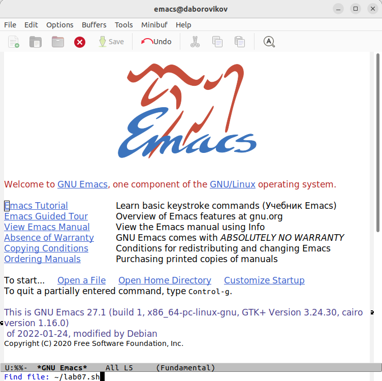{#fig:002 width=70%}

3. Наберем текст:

 #!/bin/bash

 HELL=Hello

 function hello {

 LOCAL HELLO=World

 echo $HELLO

 }

 echo $HELLO

 hello

4. Сохраним файл с помощью комбинации Ctrl-x Ctrl-s (C-x C-s).(рис. @fig:003).

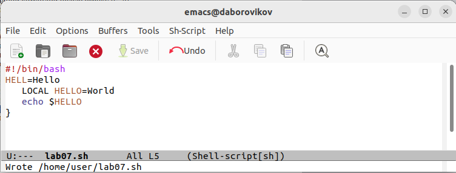{#fig:003 width=70%}

5.1. Вырежем одной командой целую строку (С-k).

5.2. Вставим эту строку в конец файла (C-y).

5.3. Выделим область текста (C-space).

5.4. Скопируем область в буфер обмена (M-w).

5.5. Вставиим область в конец файла.

5.6. Вновь выделим эту область и на этот раз вырезать её (C-w).

5.7. Отменим последнее действие (C-/).(рис. @fig:004).

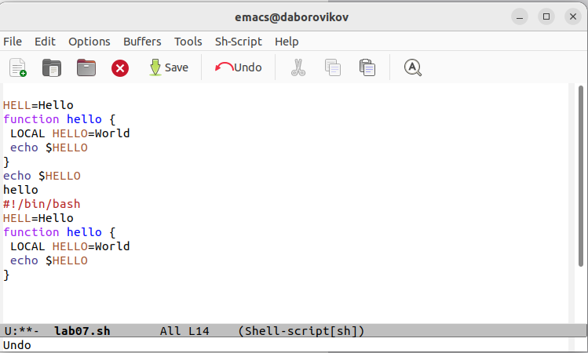{#fig:004 width=70%}

6.1. Переместим курсор в начало строки (C-a).

6.2. Переместим курсор в конец строки (C-e).

6.3. Переместим курсор в начало буфера (M-<).

6.4. Переместим курсор в конец буфера (M->). (рис. @fig:005).

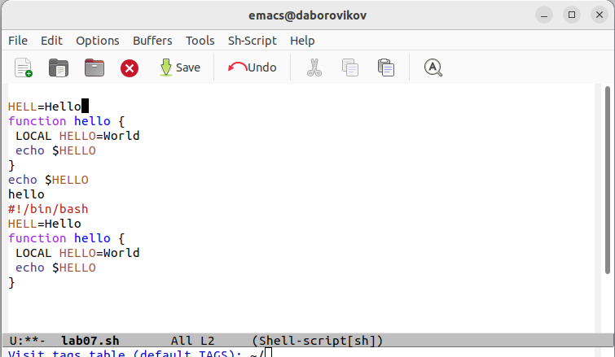{#fig:005 width=70%}

7.1. Выведем список активных буферов на экран (C-x C-b).(рис. @fig:006).

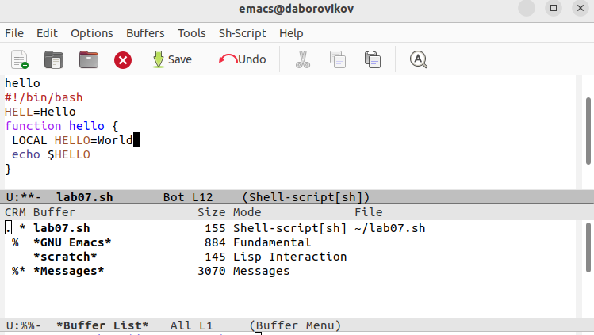{#fig:006 width=70%}

7.2. Переместим во вновь открытое окно (C-x) o со списком открытых буферов
и переключитесь на другой буфер.

7.3. Закроем это окно (C-x 0).

7.4. Теперь вновь переключимся между буферами, но уже без вывода их списка на
экран (C-x b)
 (рис. @fig:007).

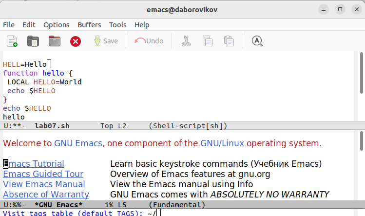{#fig:007 width=70%}

8.1. Поделите фрейм на 4 части: разделим фрейм на два окна по вертикали (C-x 3),а затем каждое из этих окон на две части по горизонтали (C-x 2)(рис. @fig:008).

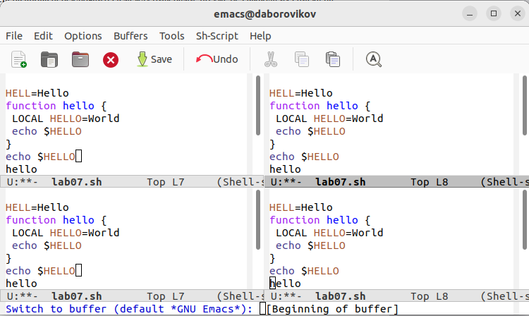{#fig:008 width=70%}

8.2. В каждом из четырёх созданных окон откроем новый буфер (файл) и введите
несколько строк текста(рис. @fig:009).

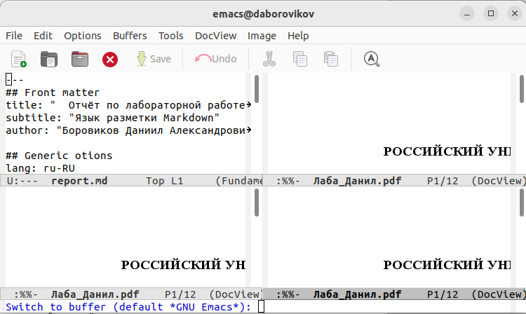{#fig:009 width=70%}

9.1. Переключимся в режим поиска (C-s) и найдите несколько слов, присутствующихт в тексте.

9.2. Переключимся между результатами поиска, нажимая C-s.

9.3. Выйдем из режима поиска, нажав C-g(рис. @fig:010).

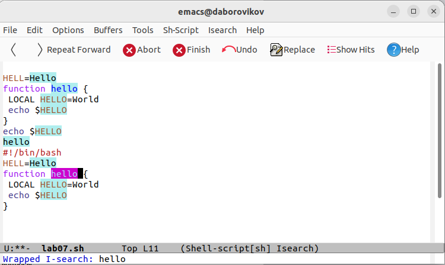{#fig:010 width=70%}

9.4. Перейдем в режим поиска и замены (M-%), введите текст, который следует найти и заменим, нажмите Enter , затем введите текст для замены. После того как будут подсвечены результаты поиска, нажмем ! для подтверждения замены(рис. @fig:011).

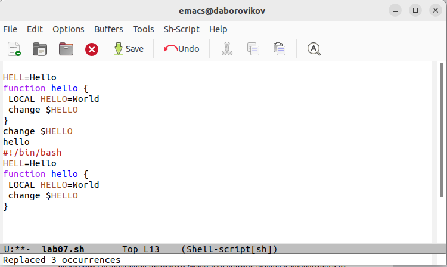{#fig:011 width=70%}

9.5. Испробуем другой режим поиска, нажав M-s o. Этот режим поиска отличается выводом более подробной информации имени фала в котором находится это слово и указание строки.(рис. @fig:012).

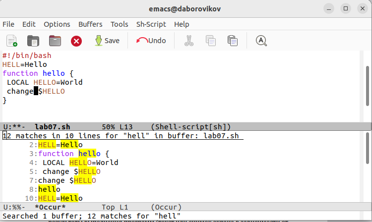{#fig:012 width=70%}

# Выводы

В ходе лабораторной работы мы познакомились с операционной системой Linux. Получили практические навыки работы с редактором Emacs.

# Контрольные вопросы

1. Кратко охарактеризуйте редактор emacs.

Emacs это один из наиболее мощных и широко распространённых редакторов, используемых в мире Unix. По популярности он соперничает с редактором vi и его клонами. В зависимости от ситуации, Emacs может быть текстовым редактором; программой для чтения почты и новостей Usenet; интегрированной средой разработки (IDE); операционной системой и т.д. Всё это разнообразие достигается благодаря архитектуре Emacs, которая позволяет расширять возможности редактора при помощи языка Emacs Lisp. На языке C написаны лишь самые базовые и низкоуровневые части Emacs, включая полнофункциональный. интерпретатор языка Lisp. Таким образом, Emacs имеет встроенный язык программирования, который может использоваться для настройки, расширения и изменения поведения редактора. В действительности, большая часть того редактора, с которым пользователи Emacs работают в наши дни,написана на языке Lisp. 

2. Какие особенности данного редактора могут сделать его сложным для освоения новичком?

Основную трудность для новичков при освоении данного редактора могут составлять большое количество команд, комбинаций клавиш, которые не получится все запомнить с первого раза и поэтоупридется часто обращаться к справочным материалам. 

3. Своими словами опишите, что такое буфер и окно в терминологии emacs’а.

Буфер–это объект, представляющий собой текст. Если имеется несколько буферов, то редактировать можно только один. Обычно буфер считывает данные из файла или записывает в файл данные из буфера. Окно–это область экрана, отображающая буфер. При запуске редактора отображается одно окно, но при обращении к некоторым функциям могут открыться дополнительные окна. Окна Emacsи окна графической среды XWindow–разные вещи. Одно окно XWindowможет быть разбито на несколько окон в смысле Emacs, в каждом из которых отображается отдельный буфер. 

4. Можно ли открыть больше 10 буферов в одном окне?

Да, можно. 

5. Какие буферы создаются по умолчанию при запуске emacs?

При запуске Emacsпо умолчанию создаются следующие буферы: «scratch»(буфер для несохраненного текста) «Messages»(журнал ошибок, включающий такжеинформацию, которая появляется в области EchoArea) «GNUEmacs»(справочный буфер о редакторе). 

6. Какие клавиши вы нажмёте, чтобы ввести следующую комбинацию C-c | и C-c C-|?

C-c |сначала, удерживая «ctrl»,нажимаю «c»,после –отпускаюобе клавишии нажимаю «|» C-cC-|сначала, удерживая «ctrl»,нажимаю «с», после –отпускаю обе клавиши и, удерживая «ctrl», нажимаю «|». 

7. Как поделить текущее окно на две части?

Чтобы поделить окно на две части необходимо воспользоваться комбинацией «Ctrl-x 3»(по вертикали) или «Ctrl-x 2» (по горизонтали). 

8. В каком файле хранятся настройки редактора emacs?

Настройки Emacsхранятся в файле .emacs. 

9. Какую функцию выполняет клавиша и можно ли её переназначить?

По умолчанию клавиша «←» удаляет символперед курсором, нов редакторе её можно переназначить. Для этого необхдимоизменить конфигурацию файла .emacs. 

10. Какой редактор вам показался удобнее в работе vi или emacs? Поясните почему.

Более удобным я считаю редактор emacs, потому чтов нем проще открывать другие файлы, можно использовать сразу несколько окон, нет «Командногорежима», «Режима ввода», «Режима командной строки», которые являются немного непривычными и в какой-то степени неудобным.

