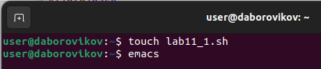
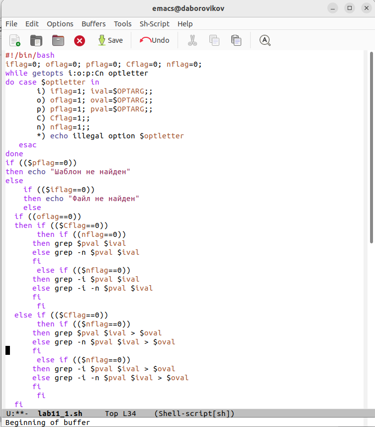
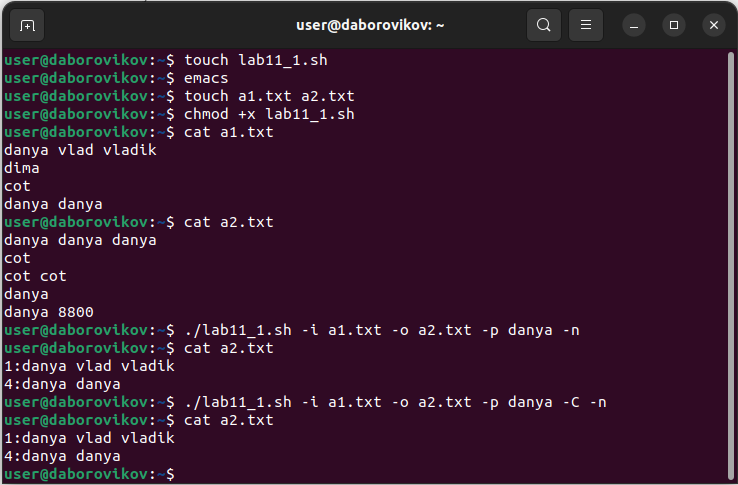
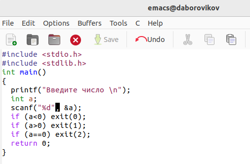
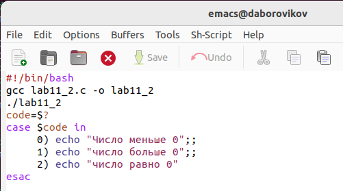
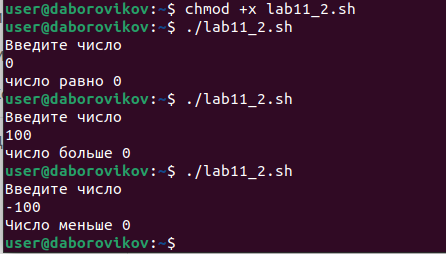
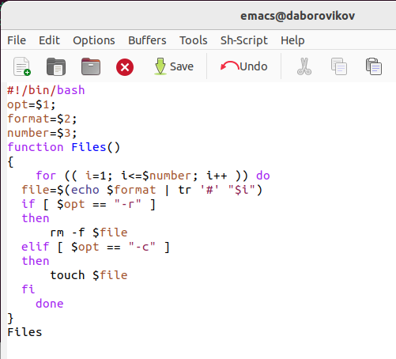
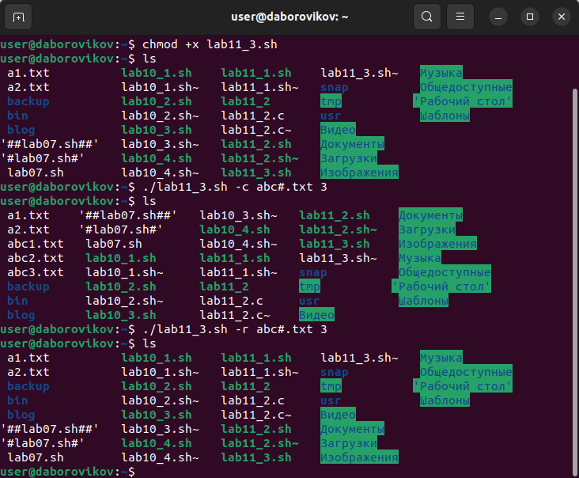
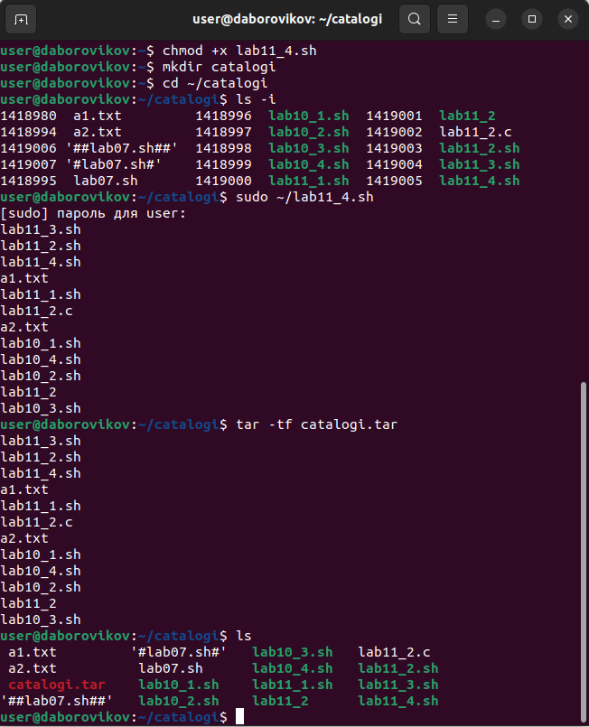

---
## Front matter
lang: ru-RU
title: презентация по лабораторной работе 11
subtitle: Программирование в командном процессоре ОС UNIX. Ветвления и циклы

author:
  - Боровиков Д.А.
institute:
  - Российский университет дружбы народов, Москва, Россия

## i18n babel
babel-lang: russian
babel-otherlangs: english

## Formatting pdf
toc: false
toc-title: Содержание
slide_level: 2
aspectratio: 169
section-titles: true
theme: metropolis
header-includes:
 - \metroset{progressbar=frametitle,sectionpage=progressbar,numbering=fraction}
 - '\makeatletter'
 - '\beamer@ignorenonframefalse'
 - '\makeatother'
---

# Информация

## Докладчик

:::::::::::::: {.columns align=center}
::: {.column width="70%"}

  * Боровиков Даниил Александрович
  * Студент ФМиЕН РУДН
  * Группа НПИбд-01-22

:::
::: {.column width="30%"}

:::
::::::::::::::

# Вводная часть

## Цели и задачи

Изучить основы программирования в оболочке ОС UNIX. Научится писать более сложные командные файлы с использованием логических управляющих конструкций и циклов.

## Создание файла lab11_1.sh

{#fig:002 width=70%}

## Написание скрипта lab11_1.sh

{#fig:003 width=70%}

## Право на выполнение и запуск lab11_1.sh

{#fig:004 width=70%}

## Написание программы на языке Си

{#fig:005 width=70%}

## Написание скрипта lab10_2.sh

{#fig:006 width=70%}

## Право на выполнение и запуск lab10_2.sh

{#fig:007 width=70%}

## Написание скрипта lab11_3.sh

{#fig:009 width=70%}

## Право на выполнение и запуск lab11_3.sh

{#fig:010 width=70%}

## Написание скрипта lab11_4.sh

{#fig:012 width=70%}

## Право на выполнение и запуск lab11_4.sh

{#fig:013 width=70%}

## Вывод

В ходе лабораторной работы мы изучили основы программирования в оболочке ОС UNIX. Научились писать более сложные командные файлы с использованием логических управляющих конструкций и циклов.
