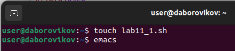
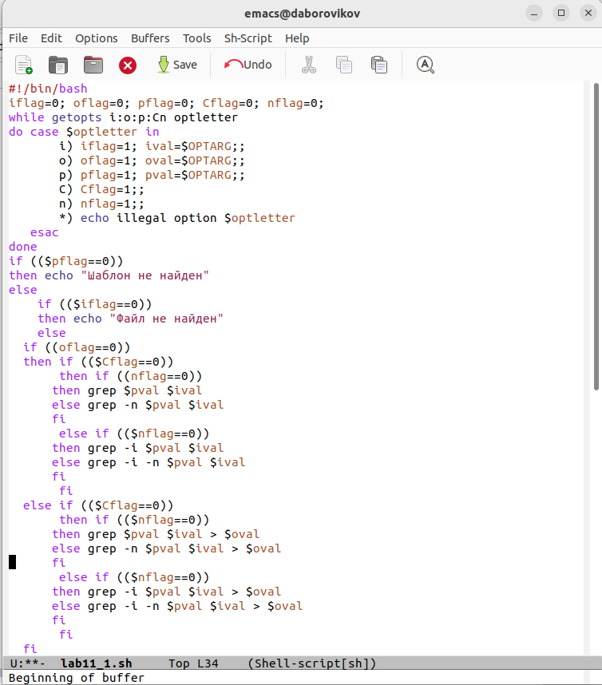
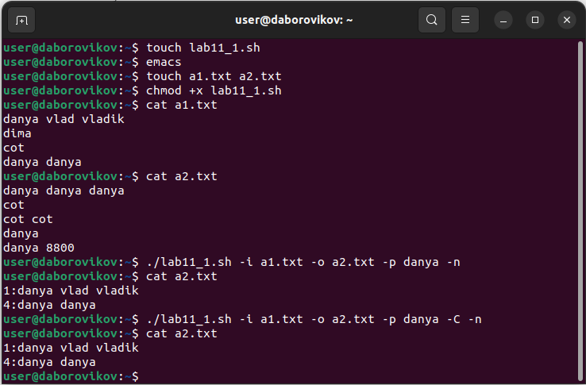
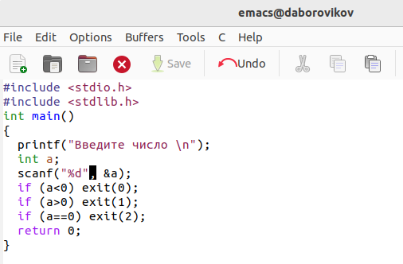
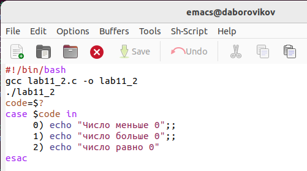
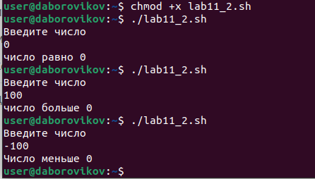
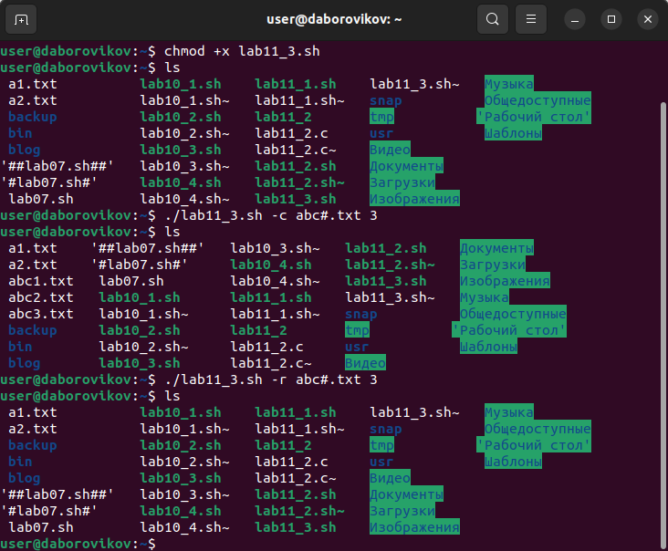
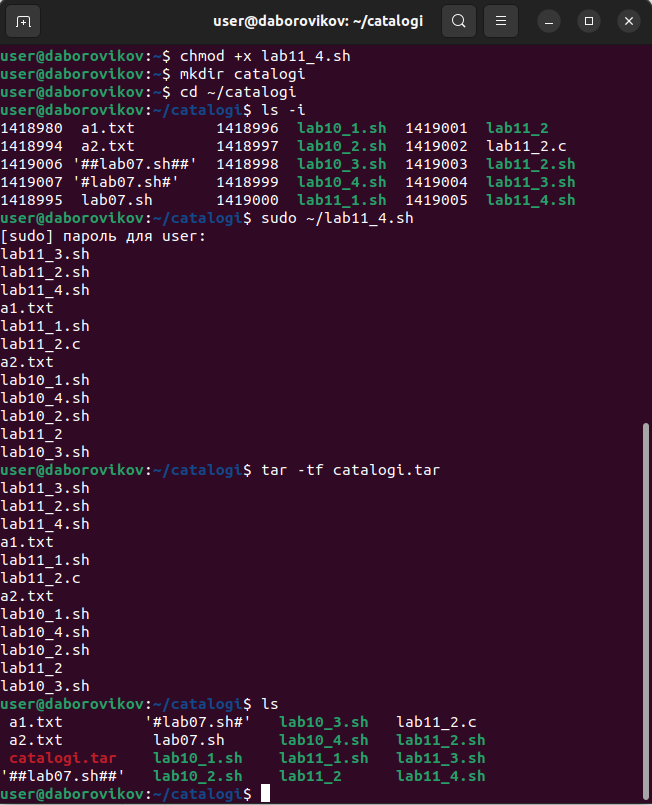
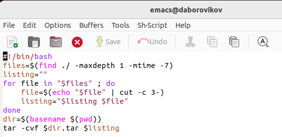

---
## Front matter
title: "Лабораторная работа No 11. "
subtitle: "Программирование в командном процессоре ОС UNIX. Ветвления и циклы"
author: "Боровиков Даниил Александрович"

## Generic otions
lang: ru-RU
toc-title: "Содержание"

## Bibliography
bibliography: bib/cite.bib
csl: pandoc/csl/gost-r-7-0-5-2008-numeric.csl

## Pdf output format
toc: true # Table of contents
toc-depth: 2
lof: true # List of figures
lot: true # List of tables
fontsize: 12pt
linestretch: 1.5
papersize: a4
documentclass: scrreprt
## I18n polyglossia
polyglossia-lang:
  name: russian
  options:
	- spelling=modern
	- babelshorthands=true
polyglossia-otherlangs:
  name: english
## I18n babel
babel-lang: russian
babel-otherlangs: english
## Fonts
mainfont: PT Serif
romanfont: PT Serif
sansfont: PT Sans
monofont: PT Mono
mainfontoptions: Ligatures=TeX
romanfontoptions: Ligatures=TeX
sansfontoptions: Ligatures=TeX,Scale=MatchLowercase
monofontoptions: Scale=MatchLowercase,Scale=0.9
## Biblatex
biblatex: true
biblio-style: "gost-numeric"
biblatexoptions:
  - parentracker=true
  - backend=biber
  - hyperref=auto
  - language=auto
  - autolang=other*
  - citestyle=gost-numeric
## Pandoc-crossref LaTeX customization
figureTitle: "Рис."
tableTitle: "Таблица"
listingTitle: "Листинг"
lofTitle: "Список иллюстраций"
lotTitle: "Список таблиц"
lolTitle: "Листинги"
## Misc options
indent: true
header-includes:
  - \usepackage{indentfirst}
  - \usepackage{float} # keep figures where there are in the text
  - \floatplacement{figure}{H} # keep figures where there are in the text
---

# Цель работы

Изучить основы программирования в оболочке ОС UNIX. Научится писать более сложные командные файлы с использованием логических управляющих конструкций и циклов.

# Выполнение лабораторной работы

Откроем терминал. Создадим в домашнем каталоге файл lab11_1.sh. Откроем emacs.(рис. @fig:002).

{#fig:002 width=70%}

Используя команды getopts grep, напишем командный файл, который анализирует
командную строку с ключами:

– -iinputfile — прочитать данные из указанного файла;

– -ooutputfile — вывести данные в указанный файл;

– -pшаблон — указать шаблон для поиска;

– -C — различать большие и малые буквы;

– -n — выдавать номера строк.

а затем ищет в указанном файле нужные строки, определяемые ключом -p.(рис. @fig:003).

{#fig:003 width=70%}

В терминале дадим файлу право на исполнение. Запустим файл и проверим.(рис. @fig:004).

{#fig:004 width=70%}

Напишем на языке Си программу, которая вводит число и определяет, является ли оно больше нуля, меньше нуля или равно нулю. Затем программа завершается с помощью функции exit(n), передавая информацию в о коде завершения в оболочку. Командный файл должен вызывать эту программу и, проанализировав с помощью команды $?, выдать сообщение о том, какое число было введено(рис. @fig:005).

{#fig:005 width=70%}

(рис. @fig:006).

{#fig:006 width=70%}

 В терминале дадим файлу право на исполнение. Запускаем файл и проверяем.(рис. @fig:007).

{#fig:007 width=70%}

Напишем командный файл, создающий указанное число файлов, пронумерованных последовательно от 1 до N (например 1.tmp, 2.tmp, 3.tmp,4.tmp и т.д.). Число файлов, которые необходимо создать, передаётся в аргументы командной строки. Этот же командный файл должен уметь удалять все созданные им файлы (если они существуют)(рис. @fig:008).

{#fig:008 width=70%}

В терминале дадим файлу право на исполнение. Запускаем файл. (рис. @fig:009).

{#fig:009 width=70%}

Напишем командный файл, который с помощью команды tar запаковывает в архив
все файлы в указанной директории. Модифицировать его так, чтобы запаковывались
только те файлы, которые были изменены менее недели тому назад (использовать
команду find).(рис. @fig:010).

{#fig:010 width=70%}

В терминале дадим файлу право на исполнение. Запускаем файл(рис. @fig:011).

{#fig:011 width=70%}

# Выводы

В ходе лабораторной работы мы изучили основы программирования в оболочке ОС UNIX. Научились писать более сложные командные файлы с использованием логических управляющих конструкций и циклов.

# Контрольные вопросы

1. Каково предназначение команды getopts?

Команда getopts осуществляет синтаксический анализ командной строки, выделяя флаги, ииспользуется для объявления переменных. Синтаксис команды следующий: getopts option-string variable [arg…] Флаги это опции командной строки, обычно помеченные знаком минус; Например, для команды ls флагом может являться -F. Строка опций option-string это список возможных букв и чисел соответствующего флага. Если ожидается, что некоторый флаг будет сопровождаться некоторым аргументом, то за символом, обозначающим этот флаг, должно следовать двоеточие. Соответствующей переменной присваивается буква данной опции. Еслик оманда getopts может распознать аргумент, то она возвращает истину. Принято включать getopts в цикл while и анализировать введённые данные с помощью оператора case. Функция getopts включает две специальные переменные среды OPTARG и OPTIND. Если ожидается доплнительное значение,то OPTARG устанавливается в значение этого аргумента. Функция getopts также понимает переменные типа массив, следовательно, можно использовать её в функции не только для синтаксического анализа аргументов функций, но и для анализа введённых пользователем данных. 

2. Какое отношение метасимволы имеют к генерации имён файлов?

Приперечислении имён файлов текущего каталога можно использовать следующие символы: 1. соответствует произвольной, в том числе и пустой строке; 2. ? соответствует любому одинарному символу; 3. [c1-c2]  соответствует любому символу, лексикографически находящемуся между символами с1 и с2. Например, 1.1 echo  выведет имена всех файлов текущего каталога, что представляет собой простейший аналог команды ls; 1.2. ls.c выведет все файлы с последними двумя символами, совпадающими с.c. 1.3. echoprog.? выведет все файлы, состоящие из пяти или шести символов, первыми пятью символами которых являются prog.. 1.4.[a-z] соответствует произвольному имени файла в текущем каталоге, начинающемуся с любой строчной буквы латинского алфавита. 

3. Какие операторы управления действиями вы знаете?

Часто бывает необходимо обеспечить проведение каких-либо действий циклически и управление дальнейшими действиями в зависимости от результатов проверки некоторого условия. Для решения подобных задач язык программирования bash предоставляет возможность использовать такие управляющие конструкции, как for, case, if иwhile. С точки зрения командного процессора эти управляющие конструкции являются обычными командами и могут использоваться как при создании командных файлов, так и при работе в интерактивном режиме. Команды, реализующие подобные конструкции, по сути, являются операторами языка программирования bash. Поэтому при описании языка программирования bash термин оператор будет использоваться наравне с термином команда. Команды ОСUNIX возвращают код завершения, значение которого может быть использовано для принятия решения о дальнейших действиях. Команда test, например, создана специально для использования в командных файлах. Единственная функция этой команды заключается в выработке кода завершения. 

4. Какие операторы используются для прерывания цикла?

Два несложных способа позволяют вам прерывать циклы в оболочке bash. Команда break завершает выполнение цикла, а команда continue завершает данную итерацию блока операторов. Команда break полезна для завершения цикла while в ситуациях, когда условие перестаёт быть правильным. Команда continue используется в ситуациях, когда больше нет необходимости выполнять блок операторов, но вы можете захотеть продолжить проверять данный блок на других условных выражениях. 

5. Для чего нужны команды false и true?

Следующие две команды ОСUNIX используются только совместно с управляющими конструкциями языка программирования bash: это команда true,которая всегда возвращает код завершения, равный нулю(т.е.истина),и команда false,которая всегда возвращает код завершения,неравный нулю(т.е.ложь).Примеры бесконечных циклов:while true do echo hello andy done until false do echo hello mike done. 

6. Что означает строка if test -f man$s/$i.$s, встреченная в командном файле?

Строка if test-fmans/i.sпроверяет,существуетлифайлmans/i.s и является ли этот файл обычным файлом.Если данный файл является каталогом,то команда вернет нулевое значение (ложь). 

7. Объясните различия между конструкциями while и until.

Выполнение оператора цикла while сводится к тому,что сначала выполняется последовательность команд(операторов), которую задаёт список-команд в строке, содержащей служебное слово while,а затем,если последняя выполненная команда из этой последовательности команд возвращает нулевой код завершения(истина),выполняется последовательность команд(операторов),которую задаёт список-команд в строке,содержащей служебное слово do,после чего осуществляется безусловный переход на начало оператора цикла while.Выход из цикла будет осуществлён тогда,когда последняя выполненная команда из последовательности команд (операторов),которую задаёт список-команд в строке,содержащей служебное слово while, возвратит ненулевой код завершения(ложь). При замене в операторе цикла while служебного слова while на until условие,при выполнении которого осуществляется выход из цикла,меняется на противоположное.В остальном оператор цикла while и оператор цикла until идентичны.
