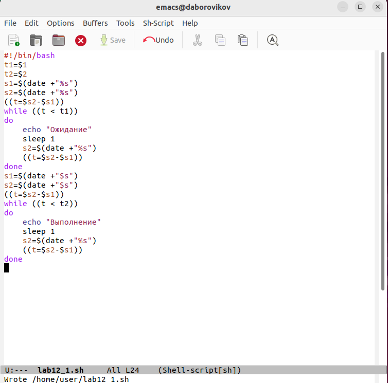
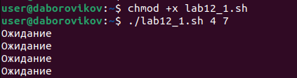
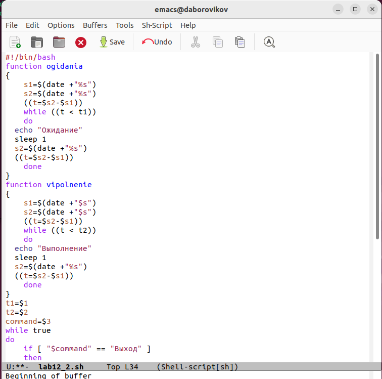
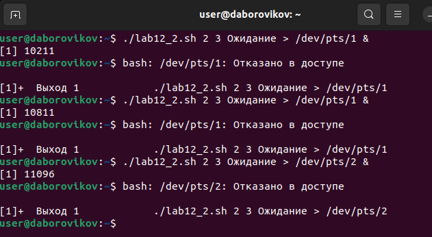
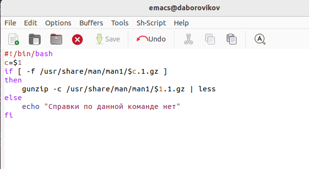
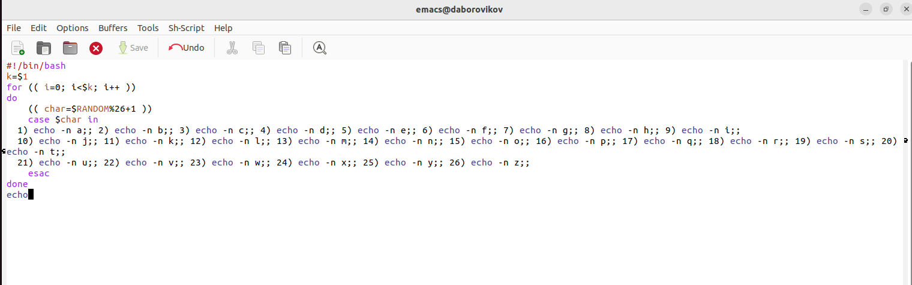
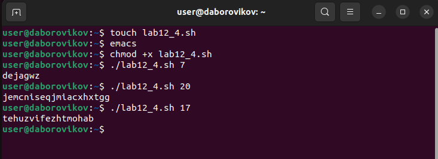

---
## Front matter
lang: ru-RU
title: презентация по лабораторной работе 12
subtitle: Программирование в командном процессоре ОС UNIX. Расширенное программирование

author:
  - Боровиков Д.А.
institute:
  - Российский университет дружбы народов, Москва, Россия

## i18n babel
babel-lang: russian
babel-otherlangs: english

## Formatting pdf
toc: false
toc-title: Содержание
slide_level: 2
aspectratio: 169
section-titles: true
theme: metropolis
header-includes:
 - \metroset{progressbar=frametitle,sectionpage=progressbar,numbering=fraction}
 - '\makeatletter'
 - '\beamer@ignorenonframefalse'
 - '\makeatother'
---

# Информация

## Докладчик

:::::::::::::: {.columns align=center}
::: {.column width="70%"}

  * Боровиков Даниил Александрович
  * Студент ФМиЕН РУДН
  * Группа НПИбд-01-22

:::
::: {.column width="30%"}

:::
::::::::::::::

# Вводная часть

## Цели и задачи

Изучить основы программирования в оболочке ОС UNIX. Научиться писать более
сложные командные файлы с использованием логических управляющих конструкций
и циклов.

## Написание скрипта lab12_1.sh

{#fig:002 width=70%}

## Право на выполнение и запуск lab12_1.s

{#fig:003 width=70%}

## Написание скрипта lab12_2.sh

{#fig:004 width=70%}

## Право на выполнение и запуск lab12_2.sh

{#fig:005 width=70%}

## Написание скрипта lab12_3.sh

{#fig:006 width=70%}

## Право на выполнение и запуск lab12_3.sh

![Право на выполнение и запуск lab12_3.sh]](7.png){#fig:007 width=70%}

## Написание скрипта lab12_4.sh

{#fig:009 width=70%}

## Право на выполнение и запуск lab12_4.sh

{#fig:010 width=70%}

## Вывод

В ходе лабораторной работы мы изучили основы программирования в оболочке ОС UNIX. Научились писать более сложные командные файлы с использованием логических управляющих конструкций и циклов.
