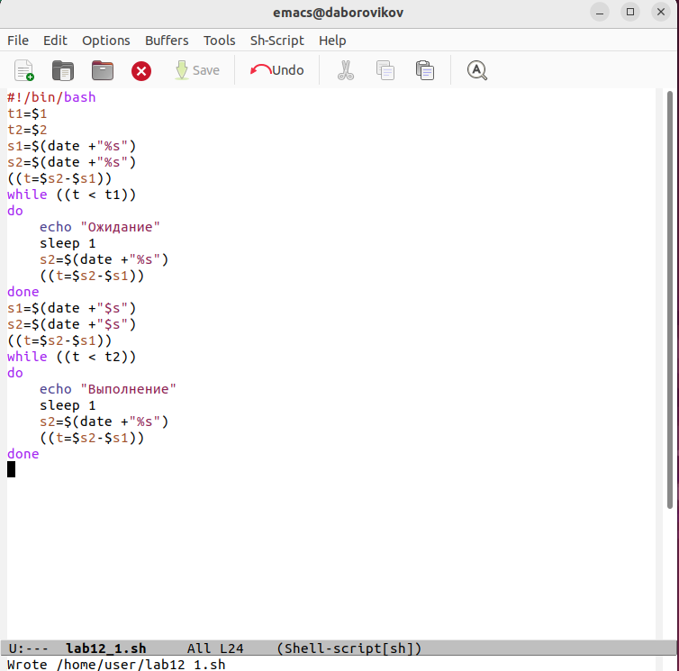

---
## Front matter
title: "Лабораторная работа No 12. "
subtitle: "Программирование в командном процессоре ОС UNIX. Расширенное программирование"
author: "Боровиков Даниил Александрович"

## Generic otions
lang: ru-RU
toc-title: "Содержание"

## Bibliography
bibliography: bib/cite.bib
csl: pandoc/csl/gost-r-7-0-5-2008-numeric.csl

## Pdf output format
toc: true # Table of contents
toc-depth: 2
lof: true # List of figures
lot: true # List of tables
fontsize: 12pt
linestretch: 1.5
papersize: a4
documentclass: scrreprt
## I18n polyglossia
polyglossia-lang:
  name: russian
  options:
	- spelling=modern
	- babelshorthands=true
polyglossia-otherlangs:
  name: english
## I18n babel
babel-lang: russian
babel-otherlangs: english
## Fonts
mainfont: PT Serif
romanfont: PT Serif
sansfont: PT Sans
monofont: PT Mono
mainfontoptions: Ligatures=TeX
romanfontoptions: Ligatures=TeX
sansfontoptions: Ligatures=TeX,Scale=MatchLowercase
monofontoptions: Scale=MatchLowercase,Scale=0.9
## Biblatex
biblatex: true
biblio-style: "gost-numeric"
biblatexoptions:
  - parentracker=true
  - backend=biber
  - hyperref=auto
  - language=auto
  - autolang=other*
  - citestyle=gost-numeric
## Pandoc-crossref LaTeX customization
figureTitle: "Рис."
tableTitle: "Таблица"
listingTitle: "Листинг"
lofTitle: "Список иллюстраций"
lotTitle: "Список таблиц"
lolTitle: "Листинги"
## Misc options
indent: true
header-includes:
  - \usepackage{indentfirst}
  - \usepackage{float} # keep figures where there are in the text
  - \floatplacement{figure}{H} # keep figures where there are in the text
---

# Цель работы

Изучить основы программирования в оболочке ОС UNIX. Научиться писать более
сложные командные файлы с использованием логических управляющих конструкций
и циклов.

# Выполнение лабораторной работы

Напишем командный файл, реализующий упрощённый механизм семафоров. Командный файл должен в течение некоторого времени t1 дожидаться освобождения ресурса, выдавая об этом сообщение, а дождавшись его освобождения, использовать его в течение некоторого времени t2<>t1, также выдавая информацию о том, что ресурс используется соответствующим командным файлом (процессом). Запустить командный файл в одном виртуальном терминале в фоновом режиме, перенаправив его вывод в другой (> /dev/tty#, где # — номер терминала куда перенаправляется вывод), в котором также запущен этот файл, но не фоновом, а в привилегированном режиме.(рис. @fig:002).

{#fig:002 width=70%}

В терминале дадим файлу право на исполнение. Запустим файл и проверим.(рис. @fig:003).

{#fig:003 width=70%}

Доработаем программу так, чтобы имелась возможность взаимодействия трёх
и более процессов.(рис. @fig:004).

{#fig:004 width=70%}

В терминале дадим файлу право на исполнение. Запустим файл и проверим.(рис. @fig:005).

{#fig:005 width=70%}

Реализуем команду man с помощью командного файла. Изучите содержимое ката-
лога /usr/share/man/man1. В нем находятся архивы текстовых файлов, содержащих
справку по большинству установленных в системе программ и команд. Каждый архив
можно открыть командой less сразу же просмотрев содержимое справки. Командный
файл должен получать в виде аргумента командной строки название команды и в виде
результата выдавать справку об этой команде или сообщение об отсутствии справки,
если соответствующего файла нет в каталоге man1.(рис. @fig:006).

{#fig:006 width=70%}

 В терминале дадим файлу право на исполнение. Запускаем файл и проверяем.(рис. @fig:007).

{#fig:007 width=70%}

Используя встроенную переменную $RANDOM, напишем командный файл, генерирующий случайную последовательность букв латинского алфавита. Учтите, что $RANDOM выдаёт псевдослучайные числа в диапазоне от 0 до 32767.(рис. @fig:008).

{#fig:008 width=70%}

В терминале дадим файлу право на исполнение. Запускаем файл. (рис. @fig:009).

{#fig:009 width=70%}

# Выводы

В ходе лабораторной работы мы изучили основы программирования в оболочке ОС UNIX. Научились писать более сложные командные файлы с использованием логических управляющих конструкций и циклов.

# Контрольные вопросы

1. Найдите синтаксическую ошибку в следующей строке:

while [$1 != "exit"]

В данной строчке допущены следующие ошибки:

- не хватает пробелов после первой скобки [и перед второй скобкой ]
- выражение $1 необходимо взять в “”, потому что эта переменная может содержать пробелы.

Таким образом, правильный вариант должен выглядеть так: while [“$1”!= “exit”] 

2. Как объединить (конкатенация) несколько строк в одну?

Чтобы объединить несколько строк в одну, можно воспользоваться несколькими способами:

- Первый:

VAR1="Hello,
“VAR2=” World"
VAR3=“VAR1VAR2”
echo “$VAR3”
Результат: Hello, World

- Второй:

VAR1=“Hello,”
VAR1+=" World"
echo “$VAR1”
Результат: Hello, World 

3. Найдите информацию об утилите seq. Какими иными способами можно реализовать её функционал при программировании на bash?

Команда seq в Linux используется для генерации чисел от ПЕРВОГО до ПОСЛЕДНЕГО шага INCREMENT.

Параметры:

- seq LAST: если задан только один аргумент, он создает числа от 1 до LAST с шагом шага, равным 1. Если LAST меньше 1, значение is не выдает.
- seq FIRST LAST: когда заданы два аргумента, он генерирует числа от FIRST до LAST с шагом 1, равным 1. Если LAST меньше FIRST, он не выдает никаких выходных данных.
- seq FIRST INCREMENT LAST: когда заданы три аргумента, он генерирует числа от FIRST до LAST на шаге INCREMENT . Если LAST меньше, чем FIRST, он не производит вывод.
- seq -f «FORMAT» FIRST INCREMENT LAST: эта команда используется для генерации последовательности в форматированном виде. FIRST и INCREMENT являются необязательными.
- seq -s «STRING» ПЕРВЫЙ ВКЛЮЧЕНО: Эта команда используется для STRING для разделения чисел. По умолчанию это значение равно /n. FIRST и INCREMENT являются необязательными.
- seq -w FIRST INCREMENT LAST:эта команда используется для выравнивания ширины путем заполнения начальными нулями. FIRST и INCREMENT являются необязательными. 

4. Какой результат даст вычисление выражения $((10/3))?

Результатом данного выражения $((10/3))будет 3, потому что это целочисленное деление без остатка. 

5. Укажите кратко основные отличия командной оболочки zsh от bash.

Отличия командной оболочки zshот bash:

- В zsh более быстрое автодополнение для cdс помощью Тab
- В zsh существует калькулятор zcalc, способный выполнять вычисления внутри терминала
- В zsh поддерживаются числа с плавающей запятой
- В zsh поддерживаются структуры данных «хэш»
- В zsh поддерживается раскрытие полного пути на основе неполных данных
- В zsh поддерживаетсязаменачастипути
- В zsh есть возможность отображать разделенный экран, такой же как разделенный экран vim 

6. Проверьте, верен ли синтаксис данной конструкции

for ((a=1; a <= LIMIT; a++)) синтаксис данной конструкции верен, потому что, используя двойные круглые скобки, можно не писать $ перед переменными (). 

7. Сравните язык bash с какими-либо языками программирования. Какие преимущества у bash по сравнению с ними? Какие недостатки?

Преимущества скриптового языка bash:

- Один из самых распространенных и ставится по умолчаниюв большинстве дистрибутивах Linux, MacOS
- Удобное перенаправление ввода/вывода
- Большое количество команд для работы с файловыми системами Linux
- Можно писать собственные скрипты, упрощающие работу в Linux

Недостатки скриптового языка bash:

- Дополнительные библиотеки других языков позволяют выполнить больше действий
- Bash не является языков общего назначения
- Утилиты, при выполнении скрипта, запускают свои процессы, которые, в свою очередь, отражаются на быстроте выполнения этого скрипта
- Скрипты, написанные на bash, нельзя запустить на других операционных системах без дополнительных действий.
