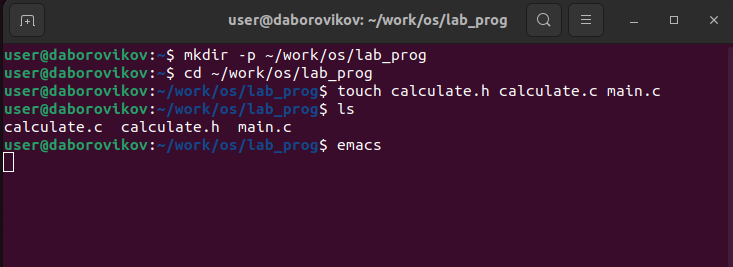
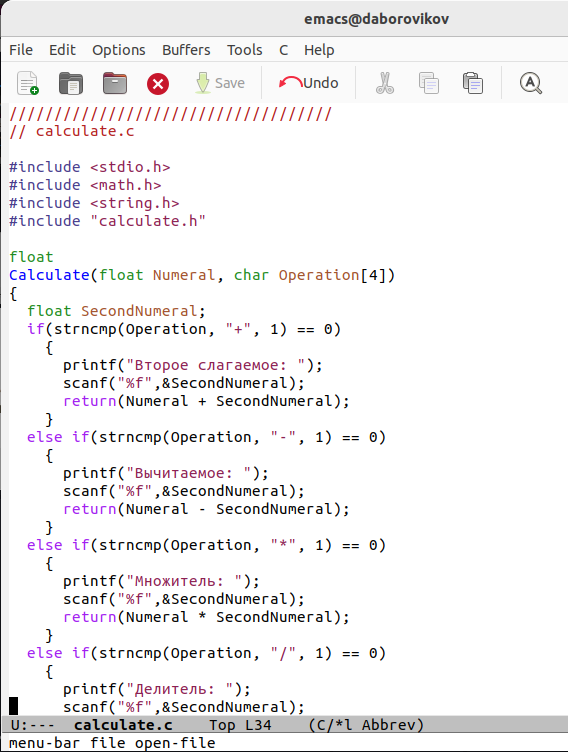
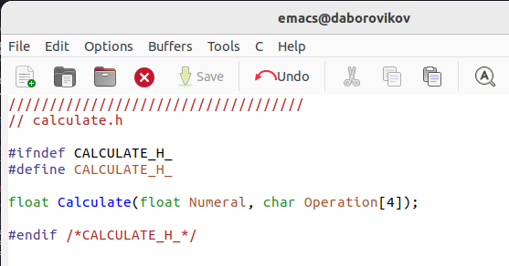
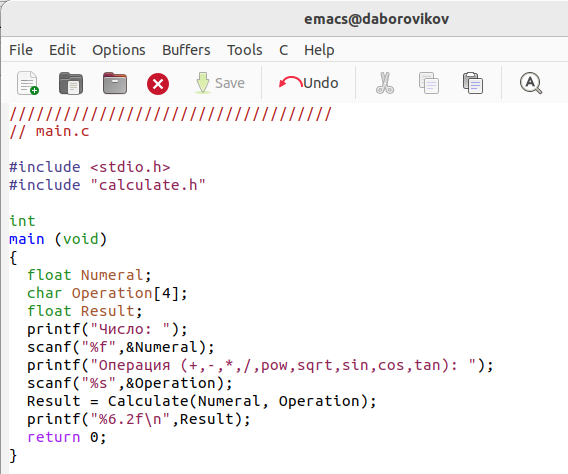
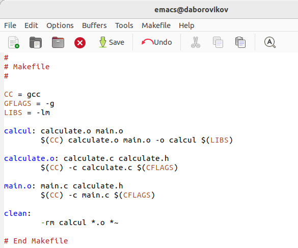
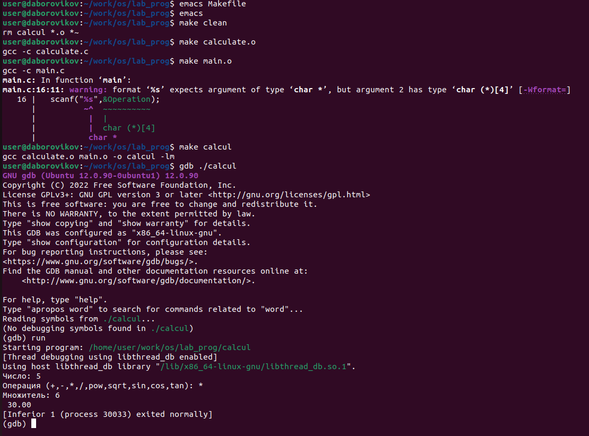
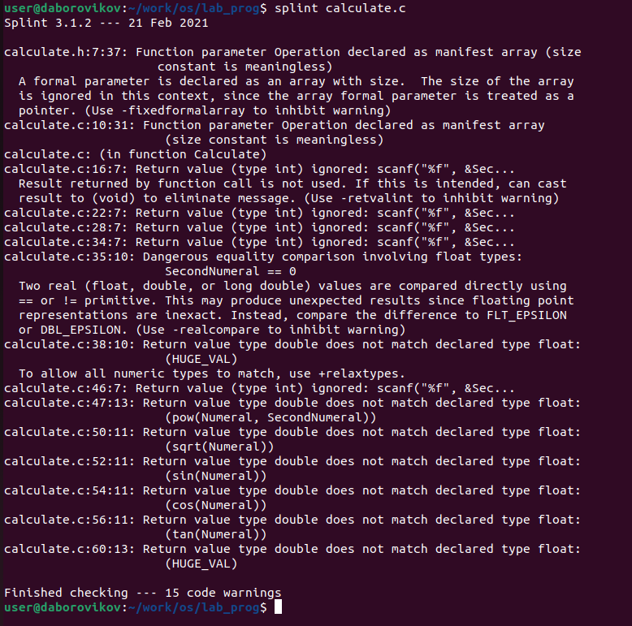

---
## Front matter
lang: ru-RU
title: презентация по лабораторной работе 13
subtitle: Программирование в командном процессоре ОС UNIX. Расширенное программирование

author:
  - Боровиков Д.А.
institute:
  - Российский университет дружбы народов, Москва, Россия

## i18n babel
babel-lang: russian
babel-otherlangs: english

## Formatting pdf
toc: false
toc-title: Содержание
slide_level: 2
aspectratio: 169
section-titles: true
theme: metropolis
header-includes:
 - \metroset{progressbar=frametitle,sectionpage=progressbar,numbering=fraction}
 - '\makeatletter'
 - '\beamer@ignorenonframefalse'
 - '\makeatother'
---

# Информация

## Докладчик

:::::::::::::: {.columns align=center}
::: {.column width="70%"}

  * Боровиков Даниил Александрович
  * Студент ФМиЕН РУДН
  * Группа НПИбд-01-22

:::
::: {.column width="30%"}

:::
::::::::::::::

# Вводная часть

## Цели и задачи

Приобрести простейшие навыки разработки, анализа, тестирования и отладки при-
ложений в ОС типа UNIX/Linux на примере создания на языке программирования
С калькулятора с простейшими функциями

## Создание нового подкаталога и файлов в нем

{#fig:002 width=70%}

## Реализация функций калькулятора в файле calculate.h:

{#fig:003 width=70%}

## Интерфейсный файл calculate.h, описывающий формат вызова функции калькулятора:

{#fig:004 width=70%}

## Основной файл main.c, реализующий интерфейс пользователя к калькулятору

{#fig:005 width=70%}

## Компиляция программы посредством gcc:

{#fig:006 width=70%}

## Создайте Makefile со следующим содержанием:

{#fig:007 width=70%}

## Отладка программы calcul

{#fig:009 width=70%}

## Анализ кода файла calculate.

{#fig:010 width=70%}

## Анализ кода файла main.c.

{#fig:010 width=70%}

## Вывод

В ходе лабораторной работы мы прибрели простейшие навыки разработки, анализа, тестирования и отладки приложений в ОС типа UNIX/Linux на примере создания на языке программирования С калькулятора с простейшими функциями
