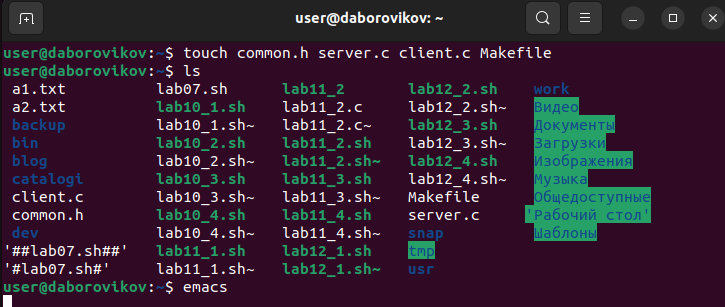
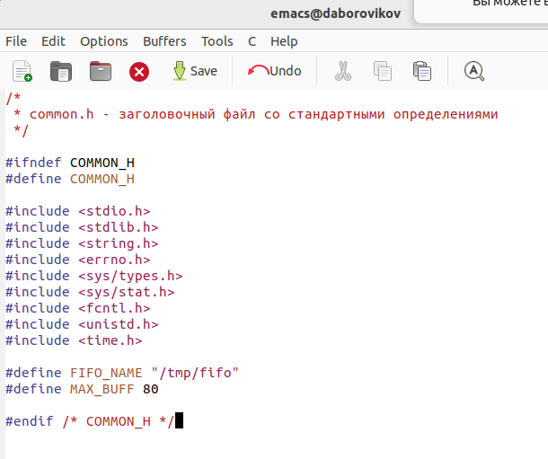
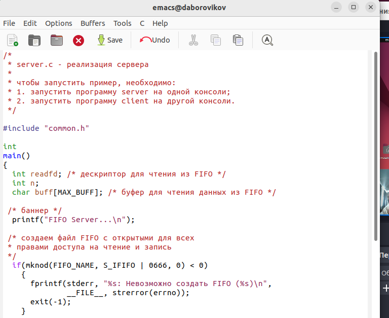
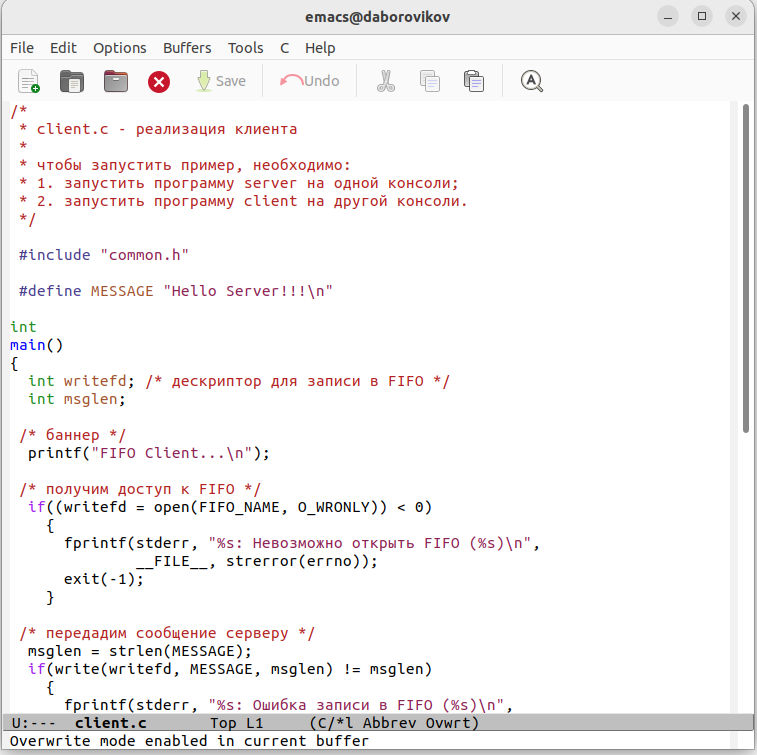
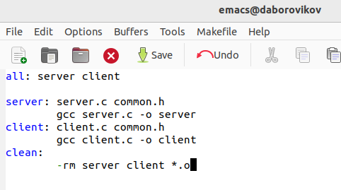
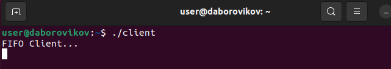

---
## Front matter
lang: ru-RU
title: презентация по лабораторной работе 13
subtitle: Программирование в командном процессоре ОС UNIX. Расширенное программирование

author:
  - Боровиков Д.А.
institute:
  - Российский университет дружбы народов, Москва, Россия

## i18n babel
babel-lang: russian
babel-otherlangs: english

## Formatting pdf
toc: false
toc-title: Содержание
slide_level: 2
aspectratio: 169
section-titles: true
theme: metropolis
header-includes:
 - \metroset{progressbar=frametitle,sectionpage=progressbar,numbering=fraction}
 - '\makeatletter'
 - '\beamer@ignorenonframefalse'
 - '\makeatother'
---

# Информация

## Докладчик

:::::::::::::: {.columns align=center}
::: {.column width="70%"}

  * Боровиков Даниил Александрович
  * Студент ФМиЕН РУДН
  * Группа НПИбд-01-22

:::
::: {.column width="30%"}

:::
::::::::::::::

# Вводная часть

## Цели и задачи

Приобрести простейшие навыки разработки, анализа, тестирования и отладки при-
ложений в ОС типа UNIX/Linux на примере создания на языке программирования
С калькулятора с простейшими функциями

## Создание файлов и переход в emacs

{ #fig:002 width=100% }

## Первый скрипт

{ #fig:003 width=70% }

## Второй скрипт

{ #fig:004 width=70% }

## Третий скрипт

{ #fig:005 width=70% }

## Четвёртый скрипт

{ #fig:006 width=70% }

## Проверка выполнения

{ #fig:007 width=100% }

# Выводы

В ходе выполнения лабораторной работы были приобретены практические навыки работы с именованными каналами.

