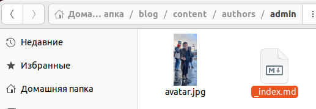
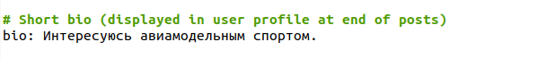
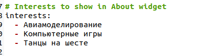
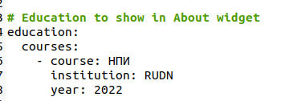
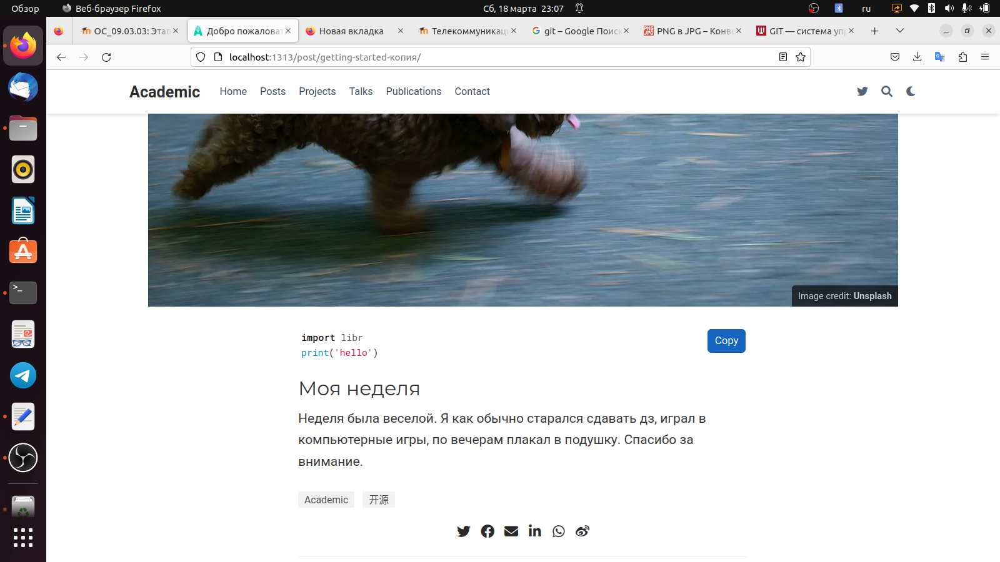
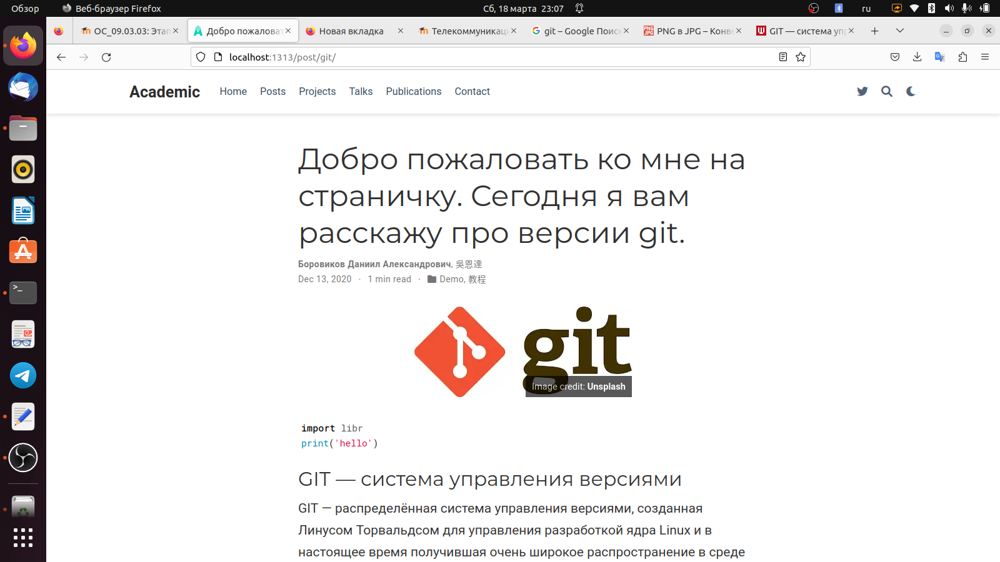

---
## Front matter
lang: ru-RU
title: презентация по ИП 2
subtitle: Посты к сайту
author:
  - Боровиков Д.А.
institute:
  - Российский университет дружбы народов, Москва, Россия

## i18n babel
babel-lang: russian
babel-otherlangs: english

## Formatting pdf
toc: false
toc-title: Содержание
slide_level: 2
aspectratio: 169
section-titles: true
theme: metropolis
header-includes:
 - \metroset{progressbar=frametitle,sectionpage=progressbar,numbering=fraction}
 - '\makeatletter'
 - '\beamer@ignorenonframefalse'
 - '\makeatother'
---

# Информация

## Докладчик

:::::::::::::: {.columns align=center}
::: {.column width="70%"}

  * Боровиков Даниил Александрович
  * Студент ФМиЕН РУДН
  * Группа НПИбд-01-22

:::
::: {.column width="30%"}

:::
::::::::::::::

# Вводная часть

## Цели и задачи

Научиться оформлять посты на сайте.

## Разместить фотографию владельца сайта.

{#fig:002 width=70%}

## Разместить краткое описание владельца сайта

{#fig:003 width=70%}

## Добавить информацию об интересах

{#fig:004 width=70%}

## Добавить информацию от образовании 

{#fig:005 width=70%}

## Сделать пост по прошедшей неделе.

{#fig:006 width=70%}

## Добавить пост на тему  Управление версиями. Git.

{#fig:007 width=70%}

## Вывод

В ходе лабораторной работы мы научилисьь оформлять посты на личном сайте
