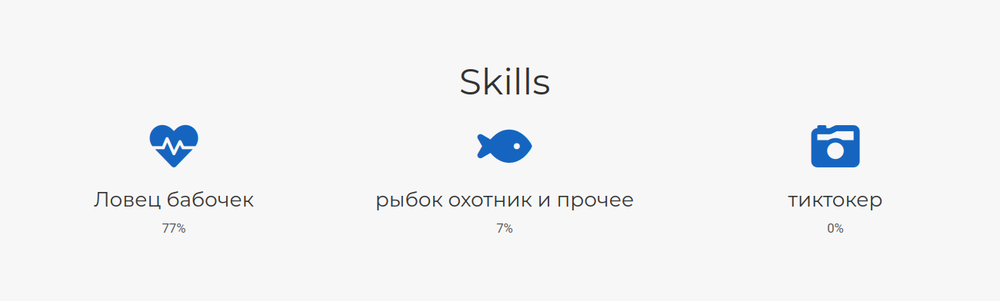
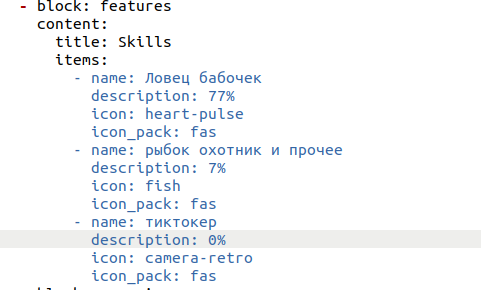
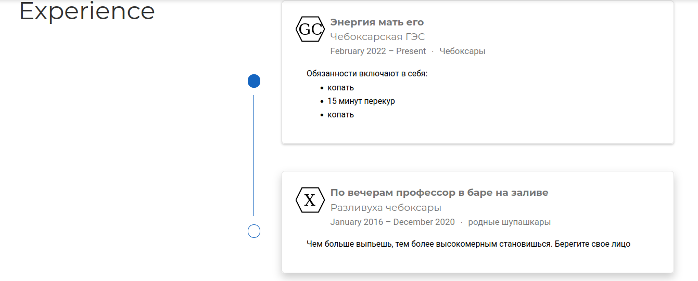
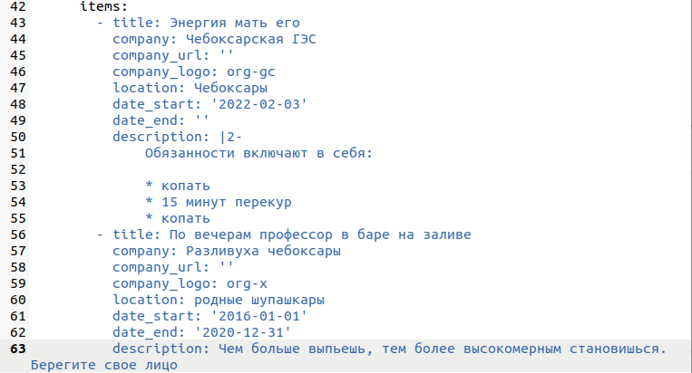
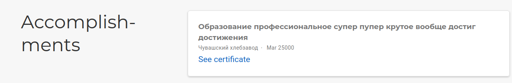
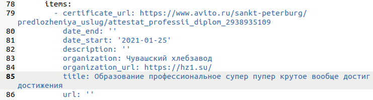
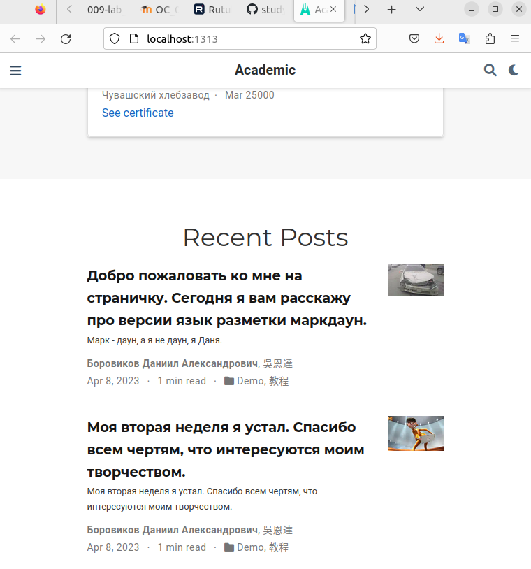

---
## Front matter
lang: ru-RU
title: презентация по ИП 3
subtitle: Достижения к сайту
author:
  - Боровиков Д.А.
institute:
  - Российский университет дружбы народов, Москва, Россия

## i18n babel
babel-lang: russian
babel-otherlangs: english

## Formatting pdf
toc: false
toc-title: Содержание
slide_level: 2
aspectratio: 169
section-titles: true
theme: metropolis
header-includes:
 - \metroset{progressbar=frametitle,sectionpage=progressbar,numbering=fraction}
 - '\makeatletter'
 - '\beamer@ignorenonframefalse'
 - '\makeatother'
---

# Информация

## Докладчик

:::::::::::::: {.columns align=center}
::: {.column width="70%"}

  * Боровиков Даниил Александрович
  * Студент ФМиЕН РУДН
  * Группа НПИбд-01-22

:::
::: {.column width="30%"}

:::
::::::::::::::

# Вводная часть

## Цели и задачи

Научиться оформлять достижения на сайте

## Добавим информацию о навыках (Skills).

{#fig:002 width=70%}

## Добавим информацию о навыках (Skills).

{#fig:003 width=70%}

## Добавим информацию об опыте (Experience).

{#fig:004 width=70%}

## Добавим информацию об опыте (Experience).

{#fig:005 width=70%}

## Добавить информацию о достижениях (Accomplishments).

{#fig:006 width=70%}

## Добавить информацию о достижениях (Accomplishments).

{#fig:007 width=70%}

## Сделаем пост по прошедшей неделе и добавим пост на тему язык разметки MarkDown

{#fig:008 width=70%}

## Вывод

В ходе лабораторной работы мы научилисьь оформлять достижения на личном сайте
